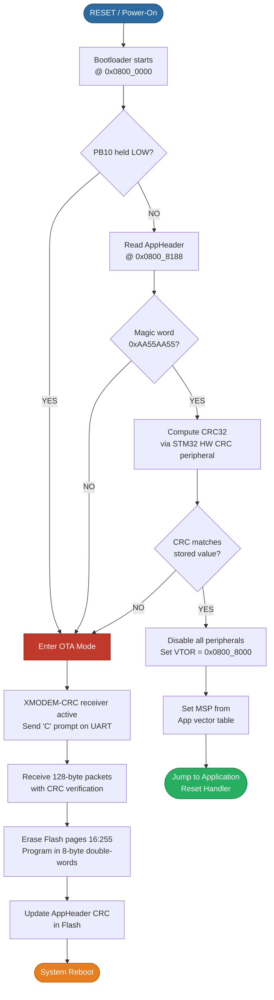
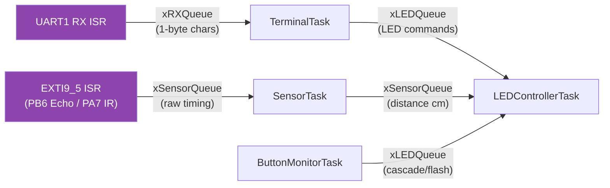

<div align="center">

# STM32-FreeRTOS Advanced Embedded System


### A production-grade embedded system featuring a custom secure bootloader with XMODEM OTA updates, five concurrent FreeRTOS tasks, hardware PWM, ultrasonic distance sensing, IR proximity detection, and a full serial CLI: all running on the STM32L476RG Nucleo board.

</div>

---

##  Table of Contents

- [Boot Sequence](#-boot-sequence)
- [Features](#-features)
- [Hardware](#-hardware)
- [System Architecture](#-system-architecture)
- [Complete Pin Mapping](#-complete-pin-mapping)
- [Quick Start](#-quick-start)
- [CLI Reference](#-cli-reference)
- [OTA Firmware Update Guide](#-ota-firmware-update-guide)
- [What I Learned / Engineering Challenges](#-what-i-learned--engineering-challenges)
- [Software & Tools](#-software--tools)
- [Project Structure](#-project-structure)
- [Documentation](#-documentation)
- [Learning Path](#-learning-path)
- [Contributing](#-contributing)
- [License](#-license)

---

##  Boot Sequence

Every power-on passes through the custom secure bootloader before the application ever gets a chance to run. The bootloader lives permanently in the lowest 32 KB of Flash and owns the reset vector.



---

##  Features

| Feature | Implementation | Hardware Used |
|---|---|---|
| **Multi-tasking RTOS** | 5 concurrent FreeRTOS tasks with separate priorities, 3 inter-task queues | STM32L476RG (Cortex-M4 @ 80 MHz) |
| **Secure Boot** | Custom bootloader: magic-word check + STM32 HW CRC32 verification before every app launch | Flash @ 0x08000000, STM32 CRC peripheral |
| **OTA Firmware Updates** | XMODEM-CRC protocol over UART; erases and reprograms app Flash sector live | UART1 (PA9/PA10), PB10 trigger button |
| **Hardware PWM** | 4 independent PWM channels across 3 timers; smooth brightness fading algorithm | TIM1_CH1, TIM2_CH2, TIM3_CH1/CH2 |
| **Ultrasonic Distance Sensing** | HC-SR04 trigger/echo; echo timed by 32-bit TIM5 at 1 MHz  cm distance; smooth 4-LED cascade | TIM5, EXTI on PB6, PC7 TRIG |
| **IR Proximity Detection** | HW-201 active-LOW interrupt; overrides ultrasonic with full-brightness blink | EXTI on PA7 (EXTI9_5 IRQ) |
| **Serial CLI** | Interrupt-driven UART RX  `xRXQueue`  TerminalTask; command parser with help system | UART1 @ 115200 baud |

---

##  Hardware


### Bill of Materials

| Component | Part Number | Role |
|---|---|---|
| Microcontroller Board | STM32L476RG Nucleo-64 | Main MCU (Cortex-M4 @ 80 MHz, 96 KB RAM, 1 MB Flash) |
| Ultrasonic Sensor | HC-SR04 | Distance measurement (2:400 cm) |
| IR Proximity Sensor | HW-201 | Object detection override |
| LEDs (4) | Standard 5mm (any colour) | PWM-controlled distance indicator bar |
| Push Button (external) | Tactile SPST | OTA trigger + LED flash command |
| USB-A to Mini-B cable | None | Power + ST-Link programming |
| Breadboard + jumper wires | None | Wiring |

---

##  System Architecture

The system is split into **two completely independent PlatformIO projects** that live in separate Flash regions and never share code. This separation means a corrupted application can never brick the device: the bootloader is always intact.

```
Flash Memory Layout

0x0800_0000 
                     SECURE BOOTLOADER (32 KB)                   
                  
                 Reset Vector (owns interrupt vector table)     
                 PB10 GPIO check on every boot                 
                 STM32 HW CRC32 engine verification            
                 XMODEM-CRC receiver (OTA mode)                
                 Flash erase / double-word programmer          
                  
0x0800_7FFF 
                               CRC OK  Jump
                              
0x0800_8000 
                     FREERTOS APPLICATION (up to ~992 KB)        
                                                                 
               [App Vector Table]  [AppHeader @ 0x08008188]      
                                                               
                                  magic + CRC32                 
                                                                
                   
                           FreeRTOS Kernel                    
                           
                 HeartbeatT  SensorTask  LED Ctrl      
                  (Pri 1)     (Pri 4)    (Pri 2)       
                           
                        xSensorQ     xLEDQ      
                 ButtonMon           
                  (Pri 3)    xSensorQ    xLEDQ         
                           
                                      
                 Terminal   xRXQueue               
                  (Pri 2)         (UART ISR)              
                                      
                   
0x080F_FFFF 
```

### Inter-Task Communication



---

##  Complete Pin Mapping

| Signal | MCU Pin | Peripheral | Direction | Notes |
|---|---|---|---|---|
| **LED1** (nearest, brightest at close range) | PB4 | TIM3_CH1 (PWM) | OUT | AF2 |
| **LED2** | PB5 | TIM3_CH2 (PWM) | OUT | AF2 |
| **LED3** | PB3 | TIM2_CH2 (PWM) | OUT | AF1 |
| **LED4** (farthest, first to light up) | PA8 | TIM1_CH1 (PWM) | OUT | AF1 |
| **HC-SR04 TRIG** | PC7 | GPIO Output | OUT | 10 s pulse to trigger |
| **HC-SR04 ECHO** | PB6 | EXTI6 (EXTI9_5_IRQ) | IN | Risingstart TIM5, Fallingcalc distance |
| **HW-201 IR OUT** | PA7 | EXTI7 (EXTI9_5_IRQ) | IN | Active LOW; falling = object detected |
| **UART1 TX** | PA9 | USART1 | OUT | 115200 8N1: CLI output + XMODEM |
| **UART1 RX** | PA10 | USART1 | IN | 115200 8N1: CLI input + XMODEM |
| **Blue Button (onboard)** | PC13 | GPIO Input (EXTI13) | IN | Active LOW; triggers LED cascade |
| **External Button (OTA trigger)** | PB10 | GPIO Input | IN | LOW on reset  OTA mode; HIGH = normal boot |
| **Heartbeat LED (onboard LD2)** | PA5 | GPIO Output | OUT | Toggled every 1 s by HeartbeatTask |

---

##  Quick Start

### Prerequisites

- [VS Code](https://code.visualstudio.com/) with the [PlatformIO IDE extension](https://platformio.org/install/ide?install=vscode)
- [Tera Term v5.6.1](https://github.com/TeraTermProject/teraterm/releases) (for XMODEM OTA transfers)
- [Python 3](https://www.python.org/downloads/) (for the CRC injection post-build script)
- A Nucleo-L476RG board + USB cable

---

### Step 1: Clone the Repository

```bash
git clone https://github.com/HeetYadav/STM32-FreeRTOS-Advanced-Embedded-System.git
cd STM32-FreeRTOS-Advanced-Embedded-System
```

---

### Step 2: Open Projects in PlatformIO

This repository contains **two separate PlatformIO projects** — one for the bootloader and one for the application. They live in different Flash regions and must be compiled and flashed independently. PlatformIO requires each project to be opened as its own root folder; opening the parent directory will not work.

Open each project in a **separate VS Code window**:

```
File -> Open Folder -> SecureBootloader_L476    (bootloader project)
File -> Open Folder -> FreeRTOS_App_L476         (application project)
```

> [!NOTE]
> If you see "No PlatformIO project found" after opening, make sure you opened the `SecureBootloader_L476` or `FreeRTOS_App_L476` subfolder directly, not the root `STM32-FreeRTOS-Advanced-Embedded-System` folder.

---

### Step 3: Wire the Hardware

> [!CAUTION]
> **Read this before connecting any wires.** The HC-SR04 ECHO pin outputs **5V**, but the STM32L476 GPIO is only 5V-tolerant on select pins. **PB6 (ECHO) requires a voltage divider** (1kΩ + 2kΩ) to step 5V down to 3.3V. Connecting ECHO directly to PB6 without the divider can permanently damage the MCU.

Quick wiring summary (see [`docs/02_hardware_wiring.md`](docs/02_hardware_wiring.md) for the full diagram):

| Component | MCU Pin | Notes |
|---|---|---|
| HC-SR04 TRIG | PC7 | Direct connection (3.3V output, 5V device accepts it) |
| HC-SR04 ECHO | PB6 | **Via 1k+2k voltage divider** — 5V -> 3.3V |
| HC-SR04 VCC | 5V (CN7 pin 18) | Must be 5V — sensor won't work at 3.3V |
| HW-201 OUT | PA7 | Direct connection (sensor powered at 3.3V) |
| LED1 (nearest) | PB4 | 220 ohm resistor to GND |
| LED2 | PB5 | 220 ohm resistor to GND |
| LED3 | PB3 | 220 ohm resistor to GND |
| LED4 (farthest) | PA8 | 220 ohm resistor to GND |
| External button | PB10 | One side to PB10, other side to GND |

---

### Step 4: Flash the Bootloader

> [!IMPORTANT]
> Flash the bootloader **first**. It must occupy `0x08000000`-`0x08007FFF` before the application is programmed.

1. Open the `SecureBootloader_L476` folder in VS Code (PlatformIO will auto-detect it)
2. Connect your Nucleo board via USB
3. Click **PlatformIO: Upload** (the arrow in the bottom toolbar) or run:

```bash
cd SecureBootloader_L476
pio run --target upload
```

Expected output:
```
Linking .pio/build/nucleo_l476rg/firmware.elf
...
** Programming Finished **
** Verify OK **
```

---

### Step 5: Flash the Application

The application uses a **post-build Python script** (`inject_crc.py`) that automatically computes CRC32 over the `.bin` file and patches the `AppHeader` struct before flashing. PlatformIO runs this automatically on build.

```bash
cd FreeRTOS_App_L476
pio run --target upload
```

Expected build output:

```
Compiling .pio/build/nucleo_l476rg/src/main.o
...
[POST-BUILD] Injecting CRC32 into AppHeader @ offset 0x188...
[POST-BUILD] CRC = 0xA3F72C11
=== [SUCCESS] Took 8.34 seconds ===
```

> [!IMPORTANT]
> If you do NOT see the `[POST-BUILD] Injecting CRC32` line, the CRC was not patched. The bootloader will reject the firmware and enter OTA mode on next boot. Ensure Python 3 is installed and added to your system PATH.

---

### Step 6: Open the Serial Terminal

Connect with any serial terminal at **115200 baud, 8N1** (e.g., Tera Term, PuTTY, VS Code Serial Monitor):

```
Port   : COMx (check Device Manager for your Nucleo's port)
Baud   : 115200
Data   : 8 bits
Parity : None
Stop   : 1 bit
```

Once connected, press **Enter** or type `help` to see all available commands:

```
=========================================
  FreeRTOS Embedded System - CLI Ready
=========================================
Type 'help' for available commands.
> help
```

Then start distance sensing:

```
> sensor start
[SENSOR] HC-SR04 active. Distance: 24 cm
[LED] Cascade: LED4 ON (24 cm)
```

---

##  CLI Reference

All commands are sent over UART1 at 115200 baud. Commands are case-sensitive and terminated with `\r\n` (Enter key).

| Command | Description | Expected Output |
|---|---|---|
| `help` | List all available commands | Formatted command list |
| `status` | Print system status: sensor state, LED mode, uptime | `[STATUS] Sensor: running \| LED mode: cascade \| Uptime: 42s` |
| `sensor start` | Enable HC-SR04 sampling (500 ms interval) | `[SENSOR] Started. Sampling every 500ms` |
| `sensor stop` | Disable HC-SR04 sampling, turn off all LEDs | `[SENSOR] Stopped.` |
| `led cascade` | Force LED cascade mode (same as normal distance mode) | `[LED] Mode: cascade` |
| `led flash` | Force all 4 LEDs to blink at 100% duty cycle | `[LED] Mode: flash (all LEDs)` |

---

##  OTA Firmware Update Guide

OTA (Over-The-Air, in this case Over-UART) updates let you reprogram the application firmware **without a debugger**. The bootloader handles all flash erase and programming operations.

> [!WARNING]
> The OTA process **erases all application Flash** (pages 16:255). Ensure your new firmware binary has been built and CRC-patched (`inject_crc.py` run) before initiating the transfer.

### Step 1: Enter OTA Mode

Hold **PB10 (external breadboard button) LOW** while pressing the **RESET button** (or cycling power). Release after reset.

```
[BOOTLOADER] PB10 asserted  Entering OTA mode
[BOOTLOADER] Erasing application Flash (pages 16-255)...
[BOOTLOADER] Ready. Waiting for XMODEM transfer...
CCCCCCCCCC
```

The repeating `C` characters on the serial terminal signal that the XMODEM-CRC receiver is waiting.

### Step 2: Configure Tera Term

Open Tera Term and connect to the Nucleo's COM port at **115200 baud, 8N1**. You should see the `CCCCCC...` prompt.

### Step 3: Send the Firmware via XMODEM

In Tera Term:

```
File  Transfer  XMODEM  Send
```

Navigate to:
```
FreeRTOS_App_L476\.pio\build\nucleo_l476rg\firmware_patched.bin
```

Select **CRC** as the checksum mode (not standard checksum). The transfer begins:

```
Sending: firmware_patched.bin
Block 1 OK
Block 2 OK
...
Block 847 OK
Transfer complete.
```

### Step 4: Watch the Automatic Reboot

When all blocks are received and programmed:

```
[BOOTLOADER] XMODEM transfer complete. 108,416 bytes received.
[BOOTLOADER] Verifying CRC32...
[BOOTLOADER] CRC OK. Rebooting into application...
```

The board reboots, the bootloader re-verifies CRC, and jumps to the new firmware. The onboard **PA5 heartbeat LED** begins blinking: confirming the new application is running.

---

##  What I Learned / Engineering Challenges

###  Bug #1: The XMODEM Unaligned Memory Access Fault

**Symptom:** XMODEM transfers would stall permanently after exactly one 128-byte packet (0.6% of a typical firmware image). The STM32 appeared to lock up silently.

**Investigation:** Attached OpenOCD debugger during the transfer. The processor had entered a **HardFault** handler. Inspected the `SCB->CFSR` (Configurable Fault Status Register): the `BFARVALID` and `IBUSERR` bits were set, indicating a bus fault on a data access. Traced the fault address back to a Flash programming loop.

**Root Cause:** The XMODEM packet structure has a 3-byte header (`SOH`, block number, complement), so the actual 128-byte payload starts at `packet[3]`. When the code tried to read 8 bytes at a time (for STM32 double-word Flash programming) using a pointer cast:
```c
// BUGGY: packet[3] is at an odd offset, causing unaligned 64-bit read
uint64_t dw = *(uint64_t*)(&packet[3 + i]);
HAL_FLASH_Program(FLASH_TYPEPROGRAM_DOUBLEWORD, address, dw);
```
The ARM Cortex-M4 does not support unaligned 64-bit (double-word) memory accesses by default: it raises a bus fault.

**Fix: one line:**
```c
// CORRECT: memcpy handles unaligned src safely; compiler emits byte-wise load
uint64_t dw;
memcpy(&dw, &packet[3 + i], 8);
HAL_FLASH_Program(FLASH_TYPEPROGRAM_DOUBLEWORD, address, dw);
```

**Lesson:** Never dereference a `uint64_t*` (or any wide pointer) cast from an arbitrary buffer offset. Use `memcpy` for unaligned reads. This rule is baked into the C standard: it's undefined behaviour regardless of architecture, but on Cortex-M4 without unaligned access support for multi-word operations, it kills the system.

---

###  Bug #2: The TIM2 Prescaler Shadow Register Bug (HC-SR04 Always Read 4 cm)

**Symptom:** The HC-SR04 sensor always returned approximately **4 cm**, regardless of actual distance. Even with a wall 1 metre away, the distance stayed locked at 4 cm.

**Investigation:** The HC-SR04 echo pulse width is measured with TIM5 running at 1 MHz (1 s per tick). After the falling-edge EXTI fires on PB6, the timer count is read and divided by 58 to get centimetres. The math was correct. Suspicion shifted to the **timer frequency**.

Checked TIM5's actual tick rate with a logic analyser: it was running far faster than 1 MHz: meaning the count was much smaller than expected for a given distance, producing artificially short (close) readings. The prescaler register was not taking effect.

**Root Cause:** On all STM32 timers, the prescaler (`PSC`) register is **shadow-buffered**. Writing to `TIM5->PSC` loads the *shadow* register, but the actual divider only updates at the next **Update Event (UEV)**. By default, the first UEV is generated by timer overflow: which on a 32-bit timer running at 80 MHz could be over 53 seconds away. The timer ran at full speed until then.

```c
// BUGGY: PSC written but never activated
TIM5->PSC = 79;  // intend 80 MHz / 80 = 1 MHz

// Missing the magic line:
// TIM5->EGR = TIM_EGR_UG;   forces immediate Update Event  PSC loads NOW
```

**Fix: one line:**
```c
TIM5->PSC = 79;          // 80 MHz / (79+1) = 1 MHz (1 s per tick)
TIM5->EGR = TIM_EGR_UG; // Force update event  shadow registers load immediately
TIM5->SR  = 0;           // Clear the UIF flag the EGR write just set
```

**Lesson:** Every STM32 timer register that is shadow-buffered (PSC, ARR, CCRx) requires a forced **Update Event** (`EGR |= TIM_EGR_UG`) to take effect before the timer overflows naturally. This is in the reference manual but easy to miss. Always force UEV after changing timer parameters.

---

###  Architectural Insight: Separating Bootloader from Application

Splitting firmware into two independent PlatformIO projects with a hard Flash boundary (`0x08008000`) and a verified handshake (`AppHeader` magic + CRC32) taught several production-grade lessons:

- **VTOR relocation is mandatory:** The application's vector table must be relocated (`SCB->VTOR = 0x08008000`) before any interrupt can fire. If the bootloader leaves VTOR at 0, every interrupt in the application routes to the bootloader's (nonexistent) handlers: instant fault.
- **MSP must be re-initialised:** Jumping to the app's reset handler does *not* automatically set the Main Stack Pointer. The bootloader must read MSP from `*(uint32_t*)0x08008000` and set it with assembly before the jump, or the app starts with the bootloader's stack pointer: stack corruption is guaranteed.
- **Peripheral state must be clean:** Any peripheral the bootloader initialised (UART, GPIO, CRC) must be fully de-initialised before jumping. The application's `HAL_Init()` assumes a clean hardware state; leftover peripheral configurations cause hard-to-diagnose init failures.

---

##  Software & Tools

| Tool | Version | Purpose |
|---|---|---|
| **PlatformIO IDE** (VS Code extension) | Latest | Build system, project management, upload |
| **STM32 HAL Library** (framework-stm32cubel4) | v1.18.1 | Hardware abstraction for all STM32 peripherals |
| **FreeRTOS** | v10.x (via PlatformIO library) | Real-time kernel: tasks, queues, scheduling |
| **ARM GCC Toolchain** (toolchain-gccarmnoneeabi) | v7.2.1 | C compiler, linker, object tools for Cortex-M4 |
| **OpenOCD** | Bundled with PlatformIO | On-chip debugger; ST-Link interface for flashing and GDB |
| **Tera Term** | v5.6.1 | Serial terminal + XMODEM file transfer for OTA updates |
| **Python 3** | 3.x | `inject_crc.py` post-build script: computes CRC32, patches `AppHeader` in `.bin` |

---

##  Project Structure

```
STM32-FreeRTOS-Advanced-Embedded-System/
|
+-- README.md                            You are here
+-- CHANGELOG.md                         Version history and bug fixes
+-- CONTRIBUTING.md                      How to contribute
+-- LICENSE                              MIT License
+-- .gitignore
|
+-- docs/                                11 deep-dive documentation files
|   +-- 00_index.md                      Navigation hub: all docs listed and linked
|   +-- 01_system_architecture.md        Full system overview: tasks, queues, ISRs
|   +-- 02_hardware_wiring.md            Pin mapping, voltage divider, wiring guide
|   +-- 03_freertos_explained.md         FreeRTOS concepts: tasks, queues, priorities
|   +-- 04_secure_bootloader.md          Bootloader: CRC, XMODEM, Flash, VTOR, MSP
|   +-- 05_hardware_pwm.md               PWM: timer config, duty cycle, fading algo
|   +-- 06_sensors_and_interrupts.md     HC-SR04, HW-201, EXTI, TIM5 stopwatch
|   +-- 07_ota_xmodem.md                 XMODEM protocol, OTA flow, troubleshooting
|   +-- 08_cli_terminal.md               UART CLI: interrupt-driven RX, command parse
|   +-- 09_performance_analysis.md       Stack usage, CPU load, ISR latency numbers
|   +-- 10_troubleshooting.md            Common problems and their fixes
|
+-- SecureBootloader_L476/               PlatformIO Project 1: Secure Bootloader
|   +-- platformio.ini                   Build config: flash origin 0x08000000
|   +-- src/
|       +-- main.c                       All bootloader logic (GPIO, CRC, XMODEM, Flash)
|   +-- README.md                        Bootloader sub-project readme
|
+-- FreeRTOS_App_L476/                   PlatformIO Project 2: FreeRTOS Application
    +-- platformio.ini                   Build config: flash origin 0x08008000
    +-- src/
    |   +-- main.c                       All FreeRTOS tasks, ISRs, peripheral init
    +-- scripts/
    |   +-- inject_crc.py                Post-build: computes CRC32, patches .bin
    +-- README.md                        Application sub-project readme
```

---

##  Documentation

Full engineering documentation lives in the [`docs/`](docs/) folder:

| Document | What You Will Learn |
|---|---|
| [00 Index](docs/00_index.md) | Navigation hub: all 11 docs listed with descriptions and reading order |
| [01 System Architecture](docs/01_system_architecture.md) | Full system map: all tasks, queues, ISRs, and how they connect |
| [02 Hardware Wiring](docs/02_hardware_wiring.md) | Pin mapping, voltage divider circuit, breadboard wiring guide, signal timing |
| [03 FreeRTOS Explained](docs/03_freertos_explained.md) | What tasks, queues, and priorities are — and why they exist |
| [04 Secure Bootloader](docs/04_secure_bootloader.md) | How the bootloader verifies firmware with CRC32 and handles OTA updates |
| [05 Hardware PWM](docs/05_hardware_pwm.md) | How hardware timers generate PWM and drive the LED bar graph |
| [06 Sensors and Interrupts](docs/06_sensors_and_interrupts.md) | HC-SR04 physics, TIM5 microsecond stopwatch, EXTI interrupt architecture |
| [07 OTA XMODEM](docs/07_ota_xmodem.md) | The XMODEM-CRC protocol explained step by step with the actual implementation |
| [08 CLI Terminal](docs/08_cli_terminal.md) | How interrupt-driven UART + FreeRTOS queue builds a real serial CLI |
| [09 Performance Analysis](docs/09_performance_analysis.md) | Stack usage, CPU load estimate, ISR latency measurements |
| [10 Troubleshooting](docs/10_troubleshooting.md) | Every common failure mode and how to fix it |

---

##  Learning Path

New to embedded systems? The [`LEARNING_PATH.md`](LEARNING_PATH.md) file gives you a structured **7-stage journey** through this entire project:

| Stage | Focus | Milestone |
|---|---|---|
| 1 | System overview | Can you draw the task/queue diagram from memory? |
| 2 | Hardware setup | Wire it up, flash it, see sensor readings |
| 3 | FreeRTOS | Trace a sensor reading from ISR to LED change |
| 4 | Sensors & interrupts | Understand the 4cm shadow register bug |
| 5 | Hardware PWM | Calculate PWM frequency from PSC and ARR |
| 6 | Bootloader | Perform a full OTA update end-to-end |
| 7 | CLI + extend | Add a new `uptime` command to the firmware |

Not sure what a technical term means? The **[Glossary](docs/glossary.md)** defines every word used in this project — EXTI, VTOR, PSC, ISR, XMODEM, queue, shadow register, and more — in plain English.

---

##  Contributing

Contributions are very welcome! Here's what would be most valuable:

- **Hardware photos**: shots of your wired-up board (breadboard, Nucleo, sensors) submitted via PR to `docs/images/`
- **Bug reports**: open a GitHub Issue with your observed behaviour, MCU register state, and debug output
- **Additional CLI commands**: fork, implement, and submit a PR with matching documentation
- **Port to other STM32 variants**: the bootloader design is board-agnostic with minor linker script changes

### Development Conventions

- All C code follows the Linux kernel naming style (snake_case, `UPPER_CASE` macros)
- Every ISR must have a comment explaining which EXTI line it services and why the flag is cleared in that order
- Every new task must document: priority rationale, worst-case execution time estimate, and which queues it reads/writes

---

##  License

This project is licensed under the **MIT License**. See the [LICENSE](LICENSE) file for full terms.

```
MIT License: Copyright (c) 2026

Permission is hereby granted, free of charge, to any person obtaining a copy
of this software and associated documentation files (the "Software"), to deal
in the Software without restriction, including without limitation the rights
to use, copy, modify, merge, publish, distribute, sublicense, and/or sell
copies of the Software, and to permit persons to whom the Software is
furnished to do so, subject to the following conditions:

The above copyright notice and this permission notice shall be included in all
copies or substantial portions of the Software.

THE SOFTWARE IS PROVIDED "AS IS", WITHOUT WARRANTY OF ANY KIND, EXPRESS OR
IMPLIED, INCLUDING BUT NOT LIMITED TO THE WARRANTIES OF MERCHANTABILITY,
FITNESS FOR A PARTICULAR PURPOSE AND NONINFRINGEMENT.
```

---

<div align="center">

**Built with FreeRTOS  STM32 HAL  PlatformIO  ARM GCC**

*If this project helped you, please consider giving it a : it helps others find it.*

</div>
