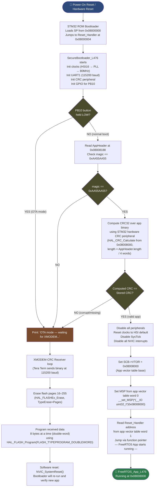
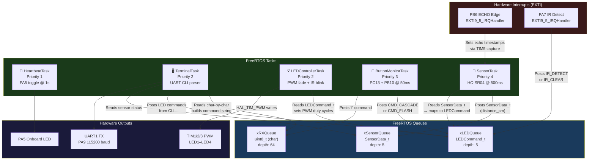

# System Architecture

> **Navigation**: [← Back to README](../README.md) | [Hardware Wiring →](02_hardware_wiring.md) | [Bootloader →](03_bootloader.md) | [FreeRTOS App →](04_freertos_app.md)

---

## Table of Contents

1. [Why Bootloader + Application?](#1-why-bootloader--application)
2. [Flash Memory Map](#2-flash-memory-map)
3. [Boot Sequence](#3-boot-sequence)
4. [FreeRTOS Task Architecture](#4-freertos-task-architecture)
5. [Interrupt Architecture](#5-interrupt-architecture)
6. [Queue Communication](#6-queue-communication)
7. [Memory Usage](#7-memory-usage)

---

## 1. Why Bootloader + Application?

### The Core Problem

Imagine you ship 100 units of an embedded product. A firmware bug is discovered, or a new feature is needed. Without a bootloader, every single unit must be physically connected to a programmer (ST-Link, J-Link, etc.) and reflashed by hand. This does not scale.

A **two-stage firmware architecture** — a small, trusted Bootloader plus a separately-upgradeable Application — solves this from day one.

### Separation of Concerns

| Layer | Responsibility | Lives at | Can be updated? |
|---|---|---|---|
| **SecureBootloader_L476** | Boot decisions, integrity verification, OTA transport | `0x08000000` | No (locked in place) |
| **FreeRTOS_App_L476** | All application logic, sensors, tasks, CLI | `0x08008000` | Yes — via XMODEM OTA |

The bootloader is intentionally simple and small (< 32 KB, < 9 KB used). It has one job: decide whether to run the application or accept a new one. It never changes after a product ships. The application, on the other hand, can be replaced entirely — over UART, without a debugger, without opening the enclosure.

### Field Updatability

This project implements **XMODEM-CRC** over UART1 (PA9/PA10, 115200 baud). The update flow is entirely driven by holding the **PB10 button** during reset:

- **Normal boot** (PB10 not held): Bootloader validates the Application using the STM32 hardware CRC peripheral, then jumps to it in under ~5ms.
- **OTA mode** (PB10 held at reset): Bootloader enters XMODEM receiver, accepts a new binary over serial, erases flash pages 16–255, and programs the new firmware — no ST-Link required.

### CRC32 Integrity Verification

The Python post-build script `inject_crc.py` computes a **CRC32** over the entire application binary (excluding the header field itself) and injects the result into an `AppHeader` struct embedded at a fixed address in flash (`0x08008188`). On every normal boot, the bootloader recomputes this CRC using the STM32 hardware CRC peripheral and compares it to the stored value. A mismatch means the firmware is corrupt or was never written — and the bootloader refuses to run it.

> [!IMPORTANT]
> The AppHeader magic value `0xAA55AA55` must be present **and** the CRC must match for the bootloader to jump to the application. Either check failing forces an OTA session.

---

## 2. Flash Memory Map

The STM32L476RG has **1 MB of flash** organized as 2 banks × 256 pages × 2 KB/page. This project uses a simple, single-bank layout where the first 32 KB (pages 0–15) is permanently reserved for the bootloader.

```mermaid
block-beta
  columns 1

  block:flash["🗂️ STM32L476RG Flash — 1MB (0x08000000 → 0x080FFFFF)"]:
    columns 1

    boot["🔒 BOOTLOADER — 32 KB (Pages 0–15)\n0x08000000 → 0x08007FFF\nSecureBootloader_L476\nNever erased by OTA"]

    vt["📌 APP VECTOR TABLE — 384 bytes\n0x08008000 → 0x0800817F\nSCB->VTOR set here at jump time\n(Stack pointer, Reset_Handler, all IRQ vectors)"]

    hdr["🏷️ APP HEADER (AppHeader struct) — 20 bytes\n0x08008188 → 0x0800819B\nmagic: 0xAA55AA55\ncrc32: computed by inject_crc.py\nlength: binary size in bytes\nversion: firmware version word"]

    app["⚙️ APP CODE + DATA — ~19 KB used\n0x080081A0 → end of used flash\nFreeRTOS_App_L476\nAll tasks, drivers, HAL, FreeRTOS kernel"]

    free["💾 FREE FLASH — ~950 KB available\nErased by OTA before reprogramming\nAvailable for future app growth\nor data logging (EEPROM emulation)"]
  end
```

### Why 0x08008000 for the App?

The bootloader occupies pages 0–15 (32 KB). The application **must** start on a page boundary — 0x08008000 is exactly page 16. The STM32 `VTOR` register (Vector Table Offset Register) requires the vector table base to be aligned to a power of 2 that is ≥ the vector table size.

For the STM32L476, the vector table has 98 entries × 4 bytes = 392 bytes, so VTOR alignment must be ≥ 512 bytes. `0x08008000` satisfies this easily.

### AppHeader Struct Layout

```c
// Located at 0x08008188 — injected by inject_crc.py post-build
typedef struct {
    uint32_t magic;    // 0x08008188 — must equal 0xAA55AA55
    uint32_t crc32;    // 0x0800818C — CRC32 of entire app binary (HAL_CRC_Calculate)
    uint32_t length;   // 0x08008190 — app size in bytes (used as CRC input length)
    uint32_t version;  // 0x08008194 — user-defined version word (e.g., 0x00010000 = v1.0)
} AppHeader_t;

// The header is placed at offset 0x188 from the app base (0x08008000),
// which is 392 bytes — immediately after the 98-entry vector table.
```

---

## 3. Boot Sequence



### Jump Mechanism (The Critical Detail)

Most documentation glosses over the actual jump. Here is the exact sequence the bootloader executes:

```c
// 1. Set VTOR so the CPU knows where the app's interrupt vectors are
SCB->VTOR = APP_BASE_ADDRESS;          // 0x08008000

// 2. Load the app's stack pointer (first word of the vector table)
__set_MSP(*(__IO uint32_t*)APP_BASE_ADDRESS);

// 3. Read the Reset_Handler address (second word of the vector table)
//    Cast it to a function pointer and call it
typedef void (*AppEntry_t)(void);
AppEntry_t app_entry = (AppEntry_t)(*(__IO uint32_t*)(APP_BASE_ADDRESS + 4));
app_entry();  // We never return from here
```

> [!WARNING]
> All peripherals **must** be de-initialized before jumping. Any peripheral left running with its interrupt enabled will fire after VTOR is set to the app — and if the app's ISR isn't ready yet, this causes a HardFault. The bootloader calls `HAL_DeInit()` and clears all NVIC pending/enable bits before the jump.

---

## 4. FreeRTOS Task Architecture

### Task Summary

| Task | Priority | Stack | Period | Role |
|---|---|---|---|---|
| **HeartbeatTask** | 1 (Low) | 128 words | 1 s | Toggles PA5 onboard LED — proves scheduler is alive |
| **TerminalTask** | 2 | 512 words | Event-driven | UART CLI — parses commands, prints status |
| **LEDControllerTask** | 2 | 256 words | Event-driven | Drives PWM fading + IR blink override |
| **SensorTask** | 4 (High) | 256 words | 500 ms | Triggers HC-SR04, reads echo, maps distance to LED queue |
| **ButtonMonitorTask** | 3 | 128 words | 50 ms | Polls PC13 (cascade) and PB10 (flash), posts to queues |

> [!NOTE]
> FreeRTOS priority 4 is **highest** in this project (higher number = higher priority, standard FreeRTOS convention). `SensorTask` runs at priority 4 to ensure the 500ms trigger cycle is never starved by lower-priority UI or LED tasks.

### Task + Queue Interaction Diagram



### Task Lifecycle and Scheduling

All tasks are created before `vTaskStartScheduler()` is called in `main()`. The FreeRTOS scheduler uses **preemptive scheduling with time-slicing** (configUSE_PREEMPTION=1, configUSE_TIME_SLICING=1). The tick rate is configured at **1000 Hz** (1ms tick), giving `pdMS_TO_TICKS()` millisecond accuracy.

```c
// Task creation — all before vTaskStartScheduler()
xTaskCreate(HeartbeatTask,       "Heartbeat", 128,  NULL, 1, NULL);
xTaskCreate(TerminalTask,        "Terminal",  512,  NULL, 2, NULL);
xTaskCreate(LEDControllerTask,   "LEDCtrl",   256,  NULL, 2, NULL);
xTaskCreate(ButtonMonitorTask,   "BtnMon",    128,  NULL, 3, NULL);
xTaskCreate(SensorTask,          "Sensor",    256,  NULL, 4, NULL);

vTaskStartScheduler();  // Never returns (idle task takes over when all tasks block)
```

---

## 5. Interrupt Architecture

The application uses a minimal interrupt footprint — only the IRQs it strictly needs. All ISRs are kept extremely short; they either capture a timer value or post to a queue, then return immediately (no processing in ISR context).

| IRQ Handler | Pin | Trigger | Action in ISR | Queue Posted |
|---|---|---|---|---|
| `EXTI9_5_IRQHandler` | PB6 (HC-SR04 ECHO) | Rising edge | Record `TIM5->CNT` as echo start timestamp | — |
| `EXTI9_5_IRQHandler` | PB6 (HC-SR04 ECHO) | Falling edge | Record `TIM5->CNT` as echo end; compute pulse width; post distance | `xSensorQueue` |
| `EXTI9_5_IRQHandler` | PA7 (HW-201 IR OUT) | Falling edge (active LOW) | Post `IR_OBJECT_DETECTED` command | `xLEDQueue` |
| `EXTI9_5_IRQHandler` | PA7 (HW-201 IR OUT) | Rising edge (object removed) | Post `IR_OBJECT_REMOVED` command | `xLEDQueue` |
| `USART1_IRQHandler` | PA10 (UART1 RX) | RXNE (byte received) | Read `UART1->RDR`, post byte to ring buffer | `xRXQueue` |
| `SysTick_Handler` | — | Every 1ms | FreeRTOS tick increment (`xPortSysTickHandler`) | — (internal) |
| `TIM5` | — | (not IRQ-driven; polled) | TIM5 free-runs at 1MHz; ISR reads CNT directly in EXTI handler | — |

> [!NOTE]
> `EXTI9_5_IRQHandler` is shared between pins 5–9 on the STM32. Both PB6 and PA7 fall in this range, so a single handler demultiplexes both sources by reading `EXTI->PR1` to check which pending flag is set.

```c
void EXTI9_5_IRQHandler(void) {
    // Check PB6 (ECHO) pending flag
    if (__HAL_GPIO_EXTI_GET_IT(GPIO_PIN_6)) {
        if (HAL_GPIO_ReadPin(GPIOB, GPIO_PIN_6) == GPIO_PIN_SET) {
            echo_start = TIM5->CNT;    // Rising: start stopwatch
        } else {
            echo_end = TIM5->CNT;      // Falling: stop stopwatch
            uint32_t pulse_us = echo_end - echo_start;  // handles wrap
            // Post to sensor queue from ISR context
            xQueueSendFromISR(xSensorQueue, &pulse_us, NULL);
        }
        __HAL_GPIO_EXTI_CLEAR_IT(GPIO_PIN_6);
    }

    // Check PA7 (IR) pending flag
    if (__HAL_GPIO_EXTI_GET_IT(GPIO_PIN_7)) {
        LEDCommand_t cmd = (HAL_GPIO_ReadPin(GPIOA, GPIO_PIN_7) == GPIO_PIN_RESET)
                           ? IR_OBJECT_DETECTED
                           : IR_OBJECT_REMOVED;
        xQueueSendFromISR(xLEDQueue, &cmd, NULL);
        __HAL_GPIO_EXTI_CLEAR_IT(GPIO_PIN_7);
    }
}
```

---

## 6. Queue Communication

FreeRTOS queues decouple producers from consumers entirely — a sensor ISR doesn't need to know anything about how LEDs are controlled, and vice versa. Every cross-task or ISR-to-task data transfer in this project goes through a queue.

| Queue | Type | Max Depth | Producer(s) | Consumer(s) | Message Meaning |
|---|---|---|---|---|---|
| `xLEDQueue` | `LEDCommand_t` (enum) | 5 | `SensorTask`, `ButtonMonitorTask`, `TerminalTask`, EXTI ISR (IR) | `LEDControllerTask` | What LED pattern to display next |
| `xRXQueue` | `uint8_t` (ASCII char) | 64 | `USART1_IRQHandler` | `TerminalTask` | One received UART byte per message |
| `xSensorQueue` | `uint32_t` (pulse µs) | 5 | `EXTI9_5_IRQHandler` (ECHO falling) | `SensorTask` | Raw echo pulse width in microseconds |

### LED Command Enum

```c
typedef enum {
    CMD_LED_OFF    = 0,   // All LEDs off (distance > 30cm)
    CMD_CASCADE_1  = 1,   // LED4 only (distance ~25-30cm)
    CMD_CASCADE_2  = 2,   // LED4 + LED3 (distance ~20-25cm)
    CMD_CASCADE_3  = 3,   // LED4 + LED3 + LED2 (distance ~10-20cm)
    CMD_CASCADE_4  = 4,   // All LEDs full (distance ≤ 5cm)
    CMD_FLASH      = 5,   // Flash all LEDs (PB10 button or 'led flash' CLI)
    IR_OBJECT_DETECTED = 6,  // IR sees object — blink all at 100%
    IR_OBJECT_REMOVED  = 7,  // IR cleared — resume ultrasonic-driven mode
} LEDCommand_t;
```

### Priority and Blocking Behavior

All queue send operations from **ISR context** use `xQueueSendFromISR()` (never `xQueueSend()` — that can block, which is illegal in an ISR). Task-context sends use `xQueueSend()` with a timeout of `pdMS_TO_TICKS(10)` — short enough not to stall, long enough not to needlessly drop messages.

`LEDControllerTask` blocks indefinitely on `xQueueReceive(xLEDQueue, &cmd, portMAX_DELAY)` — it consumes zero CPU when there is nothing to do.

---

## 7. Memory Usage

Memory utilization is tracked per-build using the PlatformIO build output. The following reflects the **release build** with `-O2` optimization.

### Application Binary (FreeRTOS_App_L476)

| Region | Used | Available | Utilization |
|---|---|---|---|
| **Flash** | 19,380 bytes (18.9 KB) | 1,048,576 bytes (1 MB) | **1.8%** |
| **RAM** | 11,080 bytes (10.8 KB) | 98,304 bytes (96 KB) | **11.3%** |

### Bootloader Binary (SecureBootloader_L476)

| Region | Used | Available | Utilization |
|---|---|---|---|
| **Flash** | 8,956 bytes (8.7 KB) | 32,768 bytes (32 KB) | **27.3%** |
| **RAM** | < 2 KB (estimated) | 98,304 bytes (96 KB) | **< 2%** |

> [!TIP]
> With 1.8% flash utilization in the application, there is enormous room to grow. The FreeRTOS heap (`configTOTAL_HEAP_SIZE`) is currently set to 8192 bytes (8 KB) — this accounts for most of the RAM usage (5 tasks × stack + 3 queues + kernel overhead). It can be increased substantially before hitting the 96 KB ceiling.

### RAM Breakdown (Approximate)

| Component | RAM Used |
|---|---|
| FreeRTOS kernel + scheduler | ~1,200 bytes |
| Task stacks (all 5 tasks) | ~4,608 bytes (128+512+256+128+256 words × 4) |
| Queue storage (3 queues) | ~384 bytes |
| HAL + peripheral drivers | ~1,800 bytes |
| Global variables + BSS | ~2,888 bytes |
| **Total** | **~11,080 bytes** |

---

> **Navigation**: [← Back to README](../README.md) | [Hardware Wiring →](02_hardware_wiring.md) | [Bootloader →](03_bootloader.md) | [FreeRTOS App →](04_freertos_app.md)
