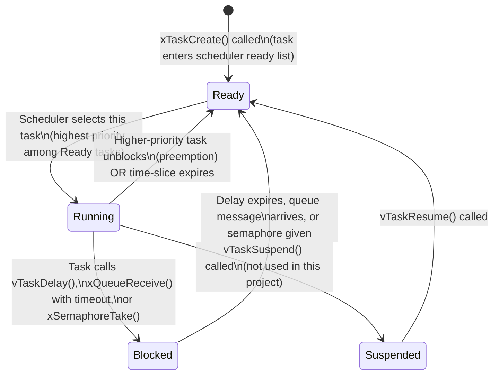

# FreeRTOS Explained: From First Principles to Our Implementation

> **Navigation**: [← 02 Bootloader Deep Dive](02_bootloader.md) | [Home](../README.md) | [04 PWM & LED Control →](04_pwm_led_control.md)

---

## Table of Contents

1. [Why RTOS Over Bare-Metal?](#1-why-rtos-over-bare-metal)
2. [Key FreeRTOS Concepts](#2-key-freertos-concepts)
3. [Our Five Tasks](#3-our-five-tasks)
4. [The Three Queues](#4-the-three-queues)
5. [ISR-to-Task Communication](#5-isr-to-task-communication)
6. [Priority Design and Real-Time Response](#6-priority-design-and-real-time-response)
7. [Stack Sizing Explained](#7-stack-sizing-explained)
8. [Task State Machine Diagram](#8-task-state-machine-diagram)

---

## 1. Why RTOS Over Bare-Metal?

### The Three Paradigms

Before choosing FreeRTOS, it helps to understand the spectrum of firmware design approaches. Each one is a trade-off between simplicity, responsiveness, and scalability.

---

#### Paradigm 1: Polling (Super-Loop)

The simplest possible firmware — an infinite loop that checks everything sequentially.

```c
// Bare-metal super-loop — simple, predictable, but fundamentally limited
int main(void) {
    HAL_Init();
    SystemClock_Config();

    while (1) {
        if (button_pressed()) handle_button();    // check button
        update_leds();                            // update LEDs
        read_ultrasonic();                        // trigger + wait for echo
        send_uart_response();                     // transmit any pending output
        // repeat — forever
    }
}
```

**Problems with polling:**

| Problem | Why It Matters |
|---|---|
| `read_ultrasonic()` blocks for ~23ms waiting for echo | During that wait, nothing else runs |
| LED update timing depends on how long button handling took | Non-deterministic jitter |
| Adding a new feature means re-tuning every timing loop | Maintenance nightmare |
| No concept of "priority" — button presses and LED updates are equals | Critical events can be starved |

> [!WARNING]
> The HC-SR04 ultrasonic sensor requires a 10µs trigger pulse followed by waiting up to **38ms** for an echo. In a polling loop, the entire system halts during this wait. This is fatal for anything else that needs timely service.

---

#### Paradigm 2: Interrupt-Driven

Better — hardware events fire ISRs that preempt the main loop. But state machines become complex, and ISRs share global state in dangerous ways.

```c
volatile uint8_t echo_done = 0;
volatile uint32_t echo_ticks = 0;

void EXTI9_5_IRQHandler(void) {
    if (rising_edge_on_PB6) {
        TIM5->CNT = 0;
        echo_done = 0;
    } else {
        echo_ticks = TIM5->CNT;
        echo_done = 1;   // set flag for main loop to pick up
    }
}

while (1) {
    if (echo_done) {
        echo_done = 0;
        uint32_t dist = echo_ticks / 58;
        // ... but what if another interrupt fires mid-calculation?
    }
}
```

**Problems with interrupt-driven bare-metal:**
- Shared volatile variables require careful `__disable_irq()` guards everywhere
- Multiple asynchronous events (button + echo + UART) create race conditions
- No natural way to express "do A, then B, then wait 500ms, then do A again" without a state machine
- As complexity grows, the ISR-to-main-loop interface becomes an undocumented mess

---

#### Paradigm 3: RTOS (Our Approach)

Each concern gets its own **task** — an independent execution context with its own stack. The RTOS kernel schedules them cooperatively/preemptively and provides safe communication primitives (queues, semaphores, mutexes).

```
┌────────────────────────────────────────────────────────────┐
│                   FreeRTOS Scheduler (1ms tick)             │
├──────────────┬──────────────┬──────────────┬───────────────┤
│ HeartbeatTask│ TerminalTask │  SensorTask  │LEDController  │
│ Priority 1   │ Priority 2   │  Priority 4  │ Priority 2    │
│              │              │  (HIGHEST)   │               │
│ Blinks PA5   │ Parses CLI   │ HC-SR04 + IR │ PWM fading    │
└──────────────┴──────────────┴──────────────┴───────────────┘
                              â–²
                         ISRs post to queues
                    (EXTI, USART, timers) ─────────┘
```

**Why this wins:**

| Feature | Bare-Metal | RTOS |
|---|---|---|
| Concurrent "blocking" waits | Impossible | Every task blocks independently |
| Priority-based response | Manual, error-prone | Kernel-enforced |
| ISR safety | `volatile` + manual guards | `FromISR` API variants |
| Adding a new feature | Re-architect the loop | Add a new task |
| Deterministic timing | Only with careful tuning | Guaranteed by scheduler |

> [!NOTE]
> RTOS adds overhead: ~5–10KB of Flash for the kernel, ~500 bytes of RAM per task stack. On our STM32L476RG (1MB Flash, 96KB RAM), this overhead is entirely acceptable. The engineering trade-off is overwhelmingly positive.

---

## 2. Key FreeRTOS Concepts

### Task

A task is a C function that runs in an **infinite loop** and never returns. Each task has its own **stack** — a private region of RAM used for local variables, function call frames, and CPU register saves. When the kernel switches between tasks (a **context switch**), it saves the current CPU register state onto the current task's stack and restores the next task's saved state.

```c
// Every FreeRTOS task has this signature
void vMyTask(void *pvParameters) {
    // One-time initialization goes here (before the loop)
    for (;;) {
        // The task's work goes here
        // MUST call a blocking API eventually — never spin-wait!
        vTaskDelay(pdMS_TO_TICKS(1000)); // sleep 1 second
    }
    // Never reaches here — tasks must not return
    vTaskDelete(NULL); // defensive: delete self if somehow reached
}
```

### Scheduler

The FreeRTOS scheduler runs on the **SysTick** timer interrupt (every 1ms by default, configurable via `configTICK_RATE_HZ`). On every tick, the scheduler checks whether a higher-priority task has become ready to run. If yes — preemption. The current task's context is saved; the higher-priority task resumes.

> [!IMPORTANT]
> FreeRTOS on STM32 uses **preemptive scheduling with time-slicing**. A higher-priority task *always* preempts a lower-priority one immediately. Equal-priority tasks share CPU in round-robin slices of one tick (1ms).

### Queue

A queue is a **thread-safe FIFO buffer** for passing data between tasks (or from ISRs to tasks). It is the primary communication primitive. No shared globals, no `volatile`, no manual critical sections needed — the queue handles all that internally.

```c
// Create: 10 slots, each holding one uint32_t value
xLEDQueue = xQueueCreate(10, sizeof(uint32_t));

// Send from any task (blocks if full, up to portMAX_DELAY)
uint32_t msg = LED_CMD_CASCADE;
xQueueSend(xLEDQueue, &msg, portMAX_DELAY);

// Receive (blocks forever until a message arrives)
uint32_t received;
xQueueReceive(xLEDQueue, &received, portMAX_DELAY);
```

### Priority

Every task has a numeric priority. **Higher number = higher priority**. FreeRTOS always runs the highest-priority task that is in the Ready state. In our system, priorities range from 1 (HeartbeatTask) to 4 (SensorTask).

> [!TIP]
> Assign the highest priority to the task that has the tightest real-time deadline, not the one that does the most work. SensorTask is priority 4 because missing an echo window would corrupt distance measurements.

### Preemption

When a task unblocks (e.g., because a queue message arrived) and its priority is higher than the currently running task, the scheduler immediately suspends the running task and switches to the newly ready task — **within the same 1ms tick**. This is what makes RTOS "real-time."

### Stack

Each task's stack is a statically or dynamically allocated block of RAM. It holds:
- The task's local variables
- Return addresses for nested function calls
- Saved CPU registers during context switches

Stack overflow is silent and catastrophic — it corrupts adjacent memory. FreeRTOS provides `configCHECK_FOR_STACK_OVERFLOW` hooks to catch this during development.

> [!WARNING]
> Stack sizes are specified in **words** (4 bytes each on ARM Cortex-M4), not bytes. A stack of `128` words = 512 bytes. Allocate generously for tasks that call `printf`, `sprintf`, or HAL functions — these use significant stack depth.

---

## 3. Our Five Tasks

Here is the complete task registry for `FreeRTOS_App_L476`:

| Task | Priority | Stack (words) | Blocks On | Posts To |
|---|---|---|---|---|
| `HeartbeatTask` | 1 (lowest) | 128 | `vTaskDelay(1000ms)` | Nothing |
| `TerminalTask` | 2 | 512 | `xRXQueue` (byte-by-byte) | `xLEDQueue`, `xSensorQueue` |
| `LEDControllerTask` | 2 | 512 | `xLEDQueue` | Nothing (drives PWM directly) |
| `ButtonMonitorTask` | 3 | 256 | `vTaskDelay(50ms)` | `xLEDQueue` |
| `SensorTask` | 4 (highest) | 512 | `xSensorQueue`, `vTaskDelay(500ms)` | `xLEDQueue` |

---

### HeartbeatTask — Priority 1

**Purpose**: The simplest possible sanity check. Toggles the onboard green LED on PA5 every 1 second. As long as this LED is blinking, the scheduler is running and the system has not crashed.

```c
void HeartbeatTask(void *pvParameters) {
    for (;;) {
        HAL_GPIO_TogglePin(GPIOA, GPIO_PIN_5);  // toggle onboard LED (PA5)
        vTaskDelay(pdMS_TO_TICKS(1000));         // sleep 1000ms — yields CPU to everyone else
    }
}
```

**Why priority 1?** The heartbeat is purely cosmetic. It must never starve any real-time task. At priority 1 (lowest), it only runs when every other task is blocked — which is exactly right. If the heartbeat *stops blinking*, it means something higher-priority is stuck in an infinite loop without yielding.

**Stack: 128 words** — This task calls no library functions and uses no local variables. 128 words (512 bytes) is conservative and safe.

---

### ButtonMonitorTask — Priority 3

**Purpose**: Polls both buttons every 50ms. PC13 (onboard blue button) triggers the LED cascade pattern. PB10 (external breadboard button) triggers the LED flash pattern.

```c
void ButtonMonitorTask(void *pvParameters) {
    uint8_t last_pc13 = 1, last_pb10 = 1; // active LOW, so idle = 1

    for (;;) {
        uint8_t cur_pc13 = HAL_GPIO_ReadPin(GPIOC, GPIO_PIN_13);
        uint8_t cur_pb10 = HAL_GPIO_ReadPin(GPIOB, GPIO_PIN_10);

        // Falling edge = button pressed (HIGH → LOW)
        if (last_pc13 == 1 && cur_pc13 == 0) {
            uint32_t cmd = LED_CMD_CASCADE;
            xQueueSend(xLEDQueue, &cmd, 0); // non-blocking send
        }
        if (last_pb10 == 1 && cur_pb10 == 0) {
            uint32_t cmd = LED_CMD_FLASH;
            xQueueSend(xLEDQueue, &cmd, 0);
        }

        last_pc13 = cur_pc13;
        last_pb10 = cur_pb10;

        vTaskDelay(pdMS_TO_TICKS(50)); // 50ms poll rate = 20Hz, good enough for debounce
    }
}
```

**Why priority 3?** Button presses are user-initiated and need sub-100ms response (feels "instant" to a human). Priority 3 puts this above Terminal (2) and Heartbeat (1) but below Sensor (4). A button press interrupting a CLI parse is fine; a sensor echo timing window being interrupted by a button poll is not.

**Stack: 256 words** — Reads two GPIO pins, maintains two local state variables, calls `xQueueSend`. Modest stack usage; 256 words is safe with margin.

---

### TerminalTask — Priority 2

**Purpose**: Implements the serial CLI. Receives bytes from `xRXQueue` (posted by the USART1 ISR), assembles them into a line buffer until `\r` or `\n`, then parses and dispatches commands.

```c
void TerminalTask(void *pvParameters) {
    char line_buf[64];
    uint8_t pos = 0;
    uint8_t byte;

    // Print startup banner
    HAL_UART_Transmit(&huart1, (uint8_t*)"\r\n> ", 4, HAL_MAX_DELAY);

    for (;;) {
        // Block here — wake up only when a byte is available in the queue
        if (xQueueReceive(xRXQueue, &byte, portMAX_DELAY) == pdTRUE) {
            if (byte == '\r' || byte == '\n') {
                line_buf[pos] = '\0';    // null-terminate
                parse_command(line_buf); // dispatch to command handler
                pos = 0;                 // reset buffer
            } else if (pos < sizeof(line_buf) - 1) {
                line_buf[pos++] = byte;  // accumulate character
            }
        }
    }
}
```

**Why priority 2?** The terminal is interactive but not time-critical. A 10ms latency in CLI echo is imperceptible to the user. Priority 2 keeps it above the heartbeat (cosmetic) but below ButtonMonitor and SensorTask.

**Stack: 512 words** — `parse_command()` calls `HAL_UART_Transmit()`, `sprintf()`, and potentially several layers of helper functions. These library functions consume significant stack. 512 words (2KB) provides safe headroom.

---

### SensorTask — Priority 4 (Highest)

**Purpose**: The core sensing loop. Every 500ms, fires the HC-SR04 trigger pulse. Listens on `xSensorQueue` for echo measurements posted by the EXTI ISR. Converts time-of-flight to distance, maps distance to an LED level, and posts to `xLEDQueue`. Also handles IR override.

```c
void SensorTask(void *pvParameters) {
    SensorMessage_t msg;

    for (;;) {
        // Fire trigger: 10µs HIGH pulse on PC7
        HAL_GPIO_WritePin(GPIOC, GPIO_PIN_7, GPIO_PIN_SET);
        vTaskDelay(pdMS_TO_TICKS(1)); // ~10µs minimum; 1ms is safe and avoids busy-wait
        HAL_GPIO_WritePin(GPIOC, GPIO_PIN_7, GPIO_PIN_RESET);

        // Wait up to 40ms for echo result from ISR
        if (xQueueReceive(xSensorQueue, &msg, pdMS_TO_TICKS(40)) == pdTRUE) {
            if (msg.type == SENSOR_ULTRASONIC) {
                uint32_t distance_cm = msg.value / 58; // time(µs) ÷ 58 = cm
                uint32_t led_level = distance_to_led_level(distance_cm);
                xQueueSend(xLEDQueue, &led_level, 0);
            } else if (msg.type == SENSOR_IR) {
                uint32_t cmd = (msg.value) ? LED_CMD_IR_ON : LED_CMD_IR_OFF;
                xQueueSend(xLEDQueue, &cmd, 0);
            }
        }

        vTaskDelay(pdMS_TO_TICKS(499)); // 500ms total cycle (1ms used by trigger)
    }
}
```

**Why priority 4?** The HC-SR04 echo window is time-critical — if the ISR posts to `xSensorQueue` and SensorTask does not wake up promptly, the timing data is still valid (it was captured in the ISR), but any downstream processing delay adds to end-to-end latency. Giving SensorTask the highest priority ensures it immediately preempts everything else when new sensor data arrives.

**Stack: 512 words** — Calls distance calculation helpers, `sprintf` for debug output, and multiple queue operations. 512 words provides comfortable margin.

---

### LEDControllerTask — Priority 2

**Purpose**: Consumes messages from `xLEDQueue` and translates them into PWM duty cycles across the four LEDs (TIM1_CH1, TIM2_CH2, TIM3_CH1, TIM3_CH2). Handles smooth fading, cascade patterns, flash sequences, and the IR override (highest LED priority).

```c
void LEDControllerTask(void *pvParameters) {
    uint32_t cmd;
    uint8_t ir_active = 0;  // IR override flag — IR beats everything else

    for (;;) {
        // Block until a LED command arrives
        if (xQueueReceive(xLEDQueue, &cmd, portMAX_DELAY) == pdTRUE) {
            switch (cmd) {
                case LED_CMD_IR_ON:
                    ir_active = 1;
                    set_all_leds_blink(100); // 100% duty, blink mode
                    break;
                case LED_CMD_IR_OFF:
                    ir_active = 0;
                    // Return to distance-driven mode on next sensor reading
                    break;
                case LED_CMD_CASCADE:
                    if (!ir_active) run_cascade_pattern(); // ignored during IR override
                    break;
                case LED_CMD_FLASH:
                    if (!ir_active) run_flash_pattern();
                    break;
                default:
                    if (!ir_active) set_led_level(cmd); // ultrasonic distance level 0–4
                    break;
            }
        }
    }
}
```

**Why priority 2?** LED control is downstream of sensing (priority 4) and button presses (priority 3). It should react quickly to commands but does not need to preempt sensors or buttons.

**Stack: 512 words** — Runs PWM fade loops with `vTaskDelay()`, calls HAL TIM functions, and maintains IR override state. Ample stack is important here.

---

## 4. The Three Queues

Queues are the backbone of inter-task communication. No task shares global state directly — all data flows through queues.

### xRXQueue — UART Receive Buffer

| Property | Value |
|---|---|
| Item size | 1 byte (`uint8_t`) |
| Depth | 64 items |
| Producer | `USART1_IRQHandler` (ISR) |
| Consumer | `TerminalTask` |

**Purpose**: Every byte received on UART1 is pushed into this queue by the interrupt handler. `TerminalTask` pulls bytes out one at a time, assembling them into command strings. The 64-byte depth absorbs fast bursts of typed input without losing characters even if TerminalTask is momentarily preempted.

```
[User types: "sensor start\r"]
       ↓  (character by character)
USART1_IRQHandler → xQueueSendFromISR → xRXQueue [s][e][n][s][o][r][ ][s][t][a][r][t][\r]
                                                          ↓
                                              TerminalTask pulls bytes, builds line buffer
                                                          ↓
                                              parse_command("sensor start")
```

---

### xSensorQueue — Sensor Event Messages

| Property | Value |
|---|---|
| Item size | `sizeof(SensorMessage_t)` (8 bytes) |
| Depth | 5 items |
| Producer | `EXTI9_5_IRQHandler` (ISR, for both HC-SR04 echo and IR events) |
| Consumer | `SensorTask` |

**Purpose**: Carries typed sensor events from the EXTI ISR to SensorTask.

```c
// Message structure — carries both sensor types through one queue
typedef struct {
    uint8_t  type;   // SENSOR_ULTRASONIC or SENSOR_IR
    uint32_t value;  // echo duration in µs (ultrasonic), or 0/1 (IR detect/clear)
} SensorMessage_t;
```

**Why a typed struct?** Both HC-SR04 (echo timing) and HW-201 IR (detect/clear events) share the same EXTI handler (`EXTI9_5_IRQHandler` serves PB6 and PA7). Using a typed message struct allows a single queue to carry both sensor types without ambiguity.

---

### xLEDQueue — LED Command Channel

| Property | Value |
|---|---|
| Item size | `sizeof(uint32_t)` (4 bytes) |
| Depth | 10 items |
| Producers | `SensorTask`, `TerminalTask`, `ButtonMonitorTask` |
| Consumer | `LEDControllerTask` |

**Purpose**: Any task that wants to change LED behavior posts a command word to this queue. `LEDControllerTask` is the sole consumer and sole owner of the PWM timers — no other task touches the LED hardware directly. This enforces **single ownership** of hardware peripherals.

```c
// Command word definitions
#define LED_CMD_CASCADE   0xA001  // run Knight Rider sweep pattern
#define LED_CMD_FLASH     0xA002  // blink all LEDs 5x at 100%
#define LED_CMD_IR_ON     0xA003  // IR obstacle detected: all LEDs blink at 100%
#define LED_CMD_IR_OFF    0xA004  // IR cleared: return to ultrasonic distance mode
// Values 0–4: ultrasonic distance level (0=all off, 4=all on at 100%)
```

> [!TIP]
> The **single-owner pattern** is the most important architectural principle in this project. Only `LEDControllerTask` calls `__HAL_TIM_SET_COMPARE()`. Only `SensorTask` reads the ultrasonic echo. Strict ownership eliminates an entire class of race conditions.

---

## 5. ISR-to-Task Communication

### The Problem: Why You Cannot Call Normal FreeRTOS APIs from an ISR

FreeRTOS queue and semaphore operations involve taking a scheduler lock, potentially blocking the caller, and possibly triggering a context switch. **None of these are safe from inside an ISR.**

An ISR runs at a hardware interrupt priority level — it has already preempted the scheduler's own data structures mid-operation. Calling `xQueueSend()` from an ISR risks corrupting the kernel's internal linked lists.

> [!CAUTION]
> Never call `xQueueSend()`, `xSemaphoreGive()`, or any non-`FromISR` FreeRTOS API from an interrupt handler. The result is undefined behavior that typically manifests as a hard fault or silent data corruption.

### The Solution: `FromISR` API Variants

FreeRTOS provides ISR-safe versions of all communication APIs. They:
1. Use a different internal locking mechanism compatible with interrupt context
2. Accept a `pxHigherPriorityTaskWoken` output parameter
3. **Never block** — they return immediately whether the operation succeeded or not

### portYIELD_FROM_ISR — Triggering Immediate Preemption

When an ISR posts a message to a queue that was previously empty, a waiting task may have just become ready to run. If that task has higher priority than the interrupted task, we want the context switch to happen **immediately** when the ISR returns — not at the next scheduler tick 1ms later.

```c
// From our EXTI9_5_IRQHandler in FreeRTOS_App_L476
void EXTI9_5_IRQHandler(void) {
    BaseType_t xHigherPriorityTaskWoken = pdFALSE; // assume no preemption needed yet

    // --- Handle PB6 (HC-SR04 Echo) ---
    if (__HAL_GPIO_EXTI_GET_IT(GPIO_PIN_6)) {
        if (HAL_GPIO_ReadPin(GPIOB, GPIO_PIN_6) == GPIO_PIN_SET) {
            // Rising edge: echo started — reset our 1µs stopwatch
            TIM5->CNT = 0;
            TIM5->CR1 |= TIM_CR1_CEN;  // start TIM5 counting at 1MHz
        } else {
            // Falling edge: echo ended — read elapsed time
            TIM5->CR1 &= ~TIM_CR1_CEN; // stop TIM5 — freeze the count
            SensorMessage_t msg;
            msg.type  = SENSOR_ULTRASONIC;
            msg.value = TIM5->CNT;      // CNT ticks = µs (TIM5 at 1MHz)

            // ISR-safe send — never blocks, sets xHigherPriorityTaskWoken if needed
            xQueueSendFromISR(xSensorQueue, &msg, &xHigherPriorityTaskWoken);
        }
        __HAL_GPIO_EXTI_CLEAR_IT(GPIO_PIN_6); // MUST clear pending bit or ISR re-fires endlessly
    }

    // --- Handle PA7 (HW-201 IR Sensor) ---
    if (__HAL_GPIO_EXTI_GET_IT(GPIO_PIN_7)) {
        SensorMessage_t msg;
        msg.type  = SENSOR_IR;
        // Active LOW: PA7 LOW = object present (1), HIGH = cleared (0)
        msg.value = (HAL_GPIO_ReadPin(GPIOA, GPIO_PIN_7) == GPIO_PIN_RESET) ? 1 : 0;

        xQueueSendFromISR(xSensorQueue, &msg, &xHigherPriorityTaskWoken);
        __HAL_GPIO_EXTI_CLEAR_IT(GPIO_PIN_7);
    }

    // If posting woke a higher-priority task, request immediate context switch
    // This sets PendSV pending — fires after all ISRs complete
    portYIELD_FROM_ISR(xHigherPriorityTaskWoken);
}
```

**Step-by-step what happens on an echo falling edge:**

```
1. HC-SR04 echo pin (PB6) goes LOW
2. EXTI9_5_IRQHandler fires (preempts whatever task was running)
3. ISR reads TIM5->CNT (echo duration in µs), builds SensorMessage_t
4. xQueueSendFromISR posts to xSensorQueue
   → xHigherPriorityTaskWoken = pdTRUE (SensorTask was blocking on this queue)
5. portYIELD_FROM_ISR(pdTRUE) sets PendSV interrupt pending
6. ISR returns → PendSV fires immediately (lowest hardware priority, fires last)
7. Scheduler context-switches to SensorTask (priority 4, highest ready task)
8. SensorTask calculates distance, posts LED command — all within microseconds
```

> [!NOTE]
> `portYIELD_FROM_ISR` works by setting the **PendSV** interrupt pending. PendSV is configured at the lowest hardware interrupt priority in STM32 FreeRTOS ports, so it fires after the current ISR (and any other pending hardware ISRs) complete — but before returning to any task code.

---

## 6. Priority Design and Real-Time Response

### Our Priority Table

| Priority | Task | Rationale |
|---|---|---|
| 4 (Highest) | `SensorTask` | HC-SR04 echo data is time-stamped in ISR; SensorTask must wake immediately to process it |
| 3 | `ButtonMonitorTask` | User button presses need sub-100ms latency to feel responsive |
| 2 | `TerminalTask` | CLI response latency of ≤50ms is imperceptible to the user |
| 2 | `LEDControllerTask` | LED visual updates lag by one scheduler tick at worst — imperceptible |
| 1 (Lowest) | `HeartbeatTask` | Purely cosmetic blink — runs only during idle time |

### Why SensorTask Must Be Highest Priority

The HC-SR04's echo duration directly encodes distance. If `SensorTask` does not process the `xSensorQueue` message quickly enough, the *data is still correct* (the ISR captured the time), but:

1. The 500ms sensing cycle gets delayed — LED response feels sluggish
2. If another trigger fires before the first is processed, queue backlog grows
3. Distance accuracy depends on timely processing feeding timely LED updates

Assigning priority 4 ensures SensorTask preempts everything else the moment sensor data arrives — even mid-UART-transmit or mid-button-poll.

### Priority Inversion Awareness

In our design, no low-priority task holds a resource that a high-priority task needs. Specifically:
- `SensorTask` (P4) communicates only through queues — it acquires no mutex
- `LEDControllerTask` (P2) owns the PWM timers exclusively and shares nothing upward
- This design avoids the classic priority inversion scenario

> [!TIP]
> If you ever add a shared resource (e.g., a shared I2C bus) accessed from tasks of different priorities, use `xSemaphoreCreateMutex()` (not a binary semaphore). FreeRTOS mutexes implement **priority inheritance** — the low-priority holder temporarily inherits the higher-priority requester's priority level, unblocking itself quickly to release the resource.

---

## 7. Stack Sizing Explained

Stack sizing is one of the most common sources of mysterious hard faults in RTOS applications. Here is the reasoning behind each task's allocation:

| Task | Stack (words) | Stack (bytes) | Why This Amount |
|---|---|---|---|
| `HeartbeatTask` | 128 | 512 | One toggle call, one delay call, no local vars. ARM Cortex-M4 exception frame = 8 registers. 128w is the recommended minimum. |
| `ButtonMonitorTask` | 256 | 1024 | Reads two GPIO pins, maintains 2 state vars, one `xQueueSend` call. Moderate depth. |
| `TerminalTask` | 512 | 2048 | Calls `sprintf()` (consumes ~300–500 bytes alone), HAL UART transmit, command parser. Must be generous. |
| `SensorTask` | 512 | 2048 | Distance calculation, `sprintf` for debug, queue operations, HAL GPIO. |
| `LEDControllerTask` | 512 | 2048 | PWM fade loops with nested function calls, HAL TIM operations, pattern sequencing. |

### The sprintf Rule of Thumb

`sprintf` and `printf` functions maintain an internal working buffer on the stack. On ARM with newlib, a `sprintf` call can consume **300–700 bytes** of stack depending on the format string and arguments. Any task that calls `sprintf` (or anything that internally calls it) needs at least 512 words (2KB) of stack.

### Detecting Stack Overflow During Development

Enable stack overflow checking in `FreeRTOSConfig.h`:

```c
#define configCHECK_FOR_STACK_OVERFLOW  2   // Method 2: checks for known pattern corruption
```

Then implement the hook:

```c
// Called by the kernel if a stack overflow is detected — never return from here
void vApplicationStackOverflowHook(TaskHandle_t xTask, char *pcTaskName) {
    (void)pcTaskName;
    __disable_irq();
    while (1); // halt — let the debugger catch it with pcTaskName still on the stack
}
```

> [!CAUTION]
> Method 2 overflow detection works by filling the bottom of the stack with a known pattern (0xA5A5A5A5) at task creation. If that pattern is overwritten, overflow is detected on the next context switch. This is reliable for moderate overflows but will not catch a stack pointer corruption that happens to skip past the canary pattern.

---

## 8. Task State Machine Diagram

Every FreeRTOS task can be in one of four states at any moment. The scheduler manages these transitions.



### State Transitions in Our System

| Event | Task Affected | Transition |
|---|---|---|
| HC-SR04 echo falls, ISR posts to xSensorQueue | SensorTask | Blocked → Ready (immediately preempts all lower-priority tasks) |
| 500ms delay expires | SensorTask | Blocked → Ready (fires trigger pulse cycle) |
| 1000ms delay expires | HeartbeatTask | Blocked → Ready (runs only when all others blocked) |
| User types a character, USART ISR posts to xRXQueue | TerminalTask | Blocked → Ready |
| 50ms poll delay expires | ButtonMonitorTask | Blocked → Ready |
| xLEDQueue receives a command from any producer | LEDControllerTask | Blocked → Ready |

### The Idle Task

FreeRTOS automatically creates an **Idle Task** at priority 0 (below all user tasks). It runs whenever all user tasks are Blocked. In our system, this happens frequently — most tasks spend the majority of their time blocked on delays or queues. You can hook into the Idle Task for low-power sleep:

```c
void vApplicationIdleHook(void) {
    // Called repeatedly while all other tasks are blocked
    // The next SysTick or hardware interrupt will wake the MCU
    __WFI(); // Wait For Interrupt — ARM sleep instruction, cuts active power significantly
}
```

> [!NOTE]
> Enabling `__WFI()` in the idle hook is a power optimization, not a correctness concern. FreeRTOS's SysTick will wake the CPU every 1ms regardless, so worst-case sleep duration is 1ms. For battery-powered applications, this is the single highest-impact power optimization available.

---

## Summary

| Concept | Our Implementation |
|---|---|
| RTOS | FreeRTOS via PlatformIO library |
| Scheduling | Preemptive, 1ms tick (SysTick) |
| Task count | 5 user tasks + 1 FreeRTOS Idle task |
| Priority range | 1 (HeartbeatTask) to 4 (SensorTask) |
| Queues | 3 — xRXQueue, xSensorQueue, xLEDQueue |
| ISR communication | `xQueueSendFromISR` + `portYIELD_FROM_ISR` |
| Stack total | ~1,920 words ≈ 7.5KB RAM for task stacks |
| Hardware peripheral ownership | Only one task ever touches each peripheral |

The FreeRTOS architecture transforms what would be a brittle, timing-dependent super-loop into a clean, extensible system where each concern is isolated, each timing requirement is met by priority, and every hardware event flows safely from ISR to task through a typed, thread-safe queue.

---

> **Navigation**: [← 02 Bootloader Deep Dive](02_bootloader.md) | [Home](../README.md) | [04 PWM & LED Control →](04_pwm_led_control.md)
