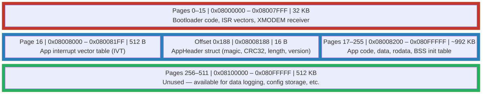

# Secure Bootloader

> **Document Version**: 1.0 | **Target MCU**: STM32L476RG | **Flash Tool**: OpenOCD via PlatformIO

---

## Table of Contents

1. [What is a Bootloader?](#1-what-is-a-bootloader)
2. [Flash Memory Map](#2-flash-memory-map)
3. [The AppHeader Struct](#3-the-appheader-struct)
4. [The CRC32 Verification Algorithm](#4-the-crc32-verification-algorithm)
5. [The Jump Mechanism](#5-the-jump-mechanism)
6. [Force Update Mode (PB10)](#6-force-update-mode-pb10)
7. [CRC Failure Handling](#7-crc-failure-handling)
8. [Security Considerations](#8-security-considerations)

---

## 1. What is a Bootloader?

Think of a bootloader as the **BIOS/UEFI of a microcontroller**. When you power on a PC, it doesn't immediately run Windows — first, the BIOS wakes up, checks hardware, finds the operating system, and hands control over. A microcontroller bootloader works the same way:

1. **Power on** → CPU starts executing from a fixed reset address (`0x08000000` on STM32)
2. **Bootloader runs first** → checks conditions (update requested? image valid?)
3. **Decision point** → either launch the main application, or enter firmware-update mode
4. **Hand off** → transfers execution to the application

**Why is this valuable?**

| Without a Bootloader | With a Bootloader |
|---|---|
| Firmware updates require a physical ST-Link debug probe | Updates can happen over any communication link (UART, USB, CAN, Wi-Fi…) |
| A corrupted flash image bricks the device | A bad image is rejected; the bootloader stays alive to accept a fix |
| No integrity checking — any binary runs | CRC32 verification ensures the image wasn't corrupted in transit |
| One monolithic firmware — no separation of concerns | Clean separation: bootloader is stable, app can be iterated independently |

On a product shipped to thousands of users in the field, the ability to push a firmware update **without physically touching the hardware** is not a luxury — it is a requirement. This bootloader is a small, self-contained PlatformIO project (**SecureBootloader_L476**) that occupies only the first 32 KB of flash and never changes once deployed.

---

## 2. Flash Memory Map

The STM32L476RG has 1 MB of flash organized in 2 KB pages (pages 0–511). Our partitioning is:

```
Flash Base: 0x08000000
Page Size:  2 KB (0x800 bytes)
```



> [!IMPORTANT]
> The bootloader and the application are **two completely separate PlatformIO projects**. Each has its own `platformio.ini` with its own `board_build.flash_offset`. They are independently compiled and independently flashed. The ST-Link (via OpenOCD) is only used to flash the bootloader once; after that, all app updates go through XMODEM over UART.

**Why 0x08008000 for the app?**

The STM32L476 flash page size is 2 KB. We reserved 16 pages (16 × 2 KB = 32 KB) for the bootloader, landing the app neatly at the start of page 16, address `0x08008000`. This alignment is mandatory — the app's interrupt vector table must start on a 512-byte boundary for the Cortex-M4 VTOR (Vector Table Offset Register).

**Why 0x08008188 for AppHeader?**

The Cortex-M4 IVT contains 98 vectors (98 × 4 bytes = 392 bytes = `0x188` bytes). So the IVT occupies `0x08008000`–`0x08008187`. The very next byte, `0x08008188`, is the first free location after the vector table — the ideal place to embed metadata about the image without wasting flash or requiring linker script gymnastics.

---

## 3. The AppHeader Struct

The AppHeader is a 16-byte structure placed at a fixed, known address in flash. Both the bootloader (to verify) and the build toolchain (to write) must agree on its layout exactly.

```c
// File: FreeRTOS_App_L476/Core/Inc/app_header.h

/**
 * @brief  Firmware image metadata — placed at FLASH_APP_BASE + 0x188.
 *
 * Layout (packed, no padding):
 *   Offset 0x00  magic_number  [4 bytes]  — signature to confirm a valid image exists
 *   Offset 0x04  crc32         [4 bytes]  — CRC32 of the entire image (0xFFFFFFFF placeholder pre-injection)
 *   Offset 0x08  image_length  [4 bytes]  — total app image size in bytes
 *   Offset 0x0C  version       [4 bytes]  — firmware version (e.g. 0x00010002 = v1.2)
 *
 * Total size: 16 bytes.
 */
typedef struct __attribute__((packed)) {
    uint32_t magic_number;   // Must equal 0xAA55AA55 — bootloader rejects anything else
    uint32_t crc32;          // Hardware CRC32 of full image; placeholder = 0xFFFFFFFF
    uint32_t image_length;   // Number of bytes in the .bin file (set by inject_crc.py)
    uint32_t version;        // 0xMMMMmmmm — upper 16 bits major, lower 16 bits minor
} AppHeader_t;

// Placed at a fixed address by the linker script:
// .app_header 0x08008188 : { KEEP(*(.app_header)) } >FLASH
#define APP_HEADER_ADDR  ((AppHeader_t *)0x08008188)
```

**Field-by-field explanation:**

| Field | Value | Purpose |
|---|---|---|
| `magic_number` | `0xAA55AA55` | A "magic number" — any valid app image must start with this exact 32-bit signature. Without it, the bootloader refuses to jump. Catches the case where flash was erased and nothing was written. |
| `crc32` | `0xFFFFFFFF` → patched | Placeholder set to `0xFFFFFFFF` in the C source. Post-build, `inject_crc.py` overwrites this with the real CRC. The bootloader reads and verifies this field. |
| `image_length` | Set by `inject_crc.py` | The exact size of the `.bin` file in bytes. Bootloader uses this to know how many bytes to feed into the CRC peripheral — no guessing, no over-reading. |
| `version` | e.g. `0x00010002` | Human-readable firmware version. Stored as `(major << 16) | minor`. Displayed on the UART CLI via `status` command. Useful for confirming a successful update. |

> [!NOTE]
> The `__attribute__((packed))` is critical. Without it, GCC may insert padding bytes between fields for alignment, causing the bootloader and build script to read/write different byte offsets. With `packed`, the struct is exactly 16 bytes with no gaps.

---

## 4. The CRC32 Verification Algorithm

### 4a. Why Hardware CRC?

The STM32L476 includes a **dedicated hardware CRC peripheral** — a single-cycle datapath that processes words at full bus speed. Using it instead of a software CRC loop has two key advantages:

| | Software CRC | Hardware CRC (STM32 peripheral) |
|---|---|---|
| **Speed** | ~50 cycles per byte (bit-by-bit loop) | 1 cycle per 32-bit word |
| **CPU usage** | 100% — the CPU is doing the math | Feed data in, read result out. CPU free for other tasks. |
| **Determinism** | Depends on compiler optimizations | Always exactly the same timing |
| **Code size** | 30–50 lines of C | ~5 lines of HAL calls |
| **Standard** | Implementation-specific | CRC-32/ISO-HDLC (same as Ethernet, ZIP) |

The STM32 hardware CRC uses the standard **CRC-32/ISO-HDLC** polynomial (`0x04C11DB7`), the same one used in Ethernet frames and ZIP files. This lets the Python build script use Python's `binascii.crc32()` — which implements the same polynomial — and produce an identical result.

### 4b. What Bytes Are Included in the CRC?

The CRC covers **the entire app image**, but with one special rule: the `crc32` field itself (4 bytes at offset `0x188` in the image, or offset `0x08` within AppHeader) is **replaced with `0xFFFFFFFF`** before calculation.

Why? Because you can't include a field in its own checksum — that's circular. The solution is to use `0xFFFFFFFF` as a stable, known placeholder. Both sides (Python script and bootloader) skip the real `crc32` bytes and substitute the same `0xFFFFFFFF` placeholder.

```
Image bytes fed to CRC engine:

[0x000] IVT (392 bytes)
[0x188] magic_number    <- included as-is
[0x18C] crc32           <- substituted as 0xFFFFFFFF
[0x190] image_length    <- included as-is
[0x194] version         <- included as-is
[0x198] ... rest of app code, data, rodata ...
[EOF  ] last byte of image
```

On the bootloader side, this is done by temporarily modifying what is fed to the CRC peripheral, not by modifying flash (which would change the CRC again):

```c
// Simplified bootloader CRC verification logic

CRC_HandleTypeDef hcrc;
hcrc.Instance = CRC;
hcrc.Init.DefaultPolynomialUse    = DEFAULT_POLYNOMIAL_ENABLE;  // 0x04C11DB7
hcrc.Init.DefaultInitValueUse     = DEFAULT_INIT_VALUE_ENABLE;  // 0xFFFFFFFF
hcrc.Init.InputDataInversionMode  = CRC_INPUTDATA_INVERSION_WORD;
hcrc.Init.OutputDataInversionMode = CRC_OUTPUTDATA_INVERSION_ENABLE;
hcrc.InputDataFormat              = CRC_INPUTDATA_FORMAT_WORDS;
HAL_CRC_Init(&hcrc);

// Read the AppHeader from flash
AppHeader_t *header = APP_HEADER_ADDR;        // pointer to 0x08008188

// Temporarily build a buffer identical to the image BUT with 0xFFFFFFFF in the crc32 slot.
// (In practice, the bootloader reads from flash word-by-word and substitutes the CRC word.)
uint32_t calculated = HAL_CRC_Calculate(&hcrc,
                                         (uint32_t *)APP_BASE_ADDR,   // 0x08008000
                                         header->image_length / 4);   // length in 32-bit words

// The hardware CRC result matches what Python computed
if (calculated == header->crc32) {
    // Image is valid — proceed to jump
} else {
    // Image corrupt or tampered — enter OTA mode
}
```

### 4c. Python inject_crc.py — Post-Build Workflow

After PlatformIO compiles and links the application, it produces a `.bin` file (a raw binary dump of flash contents). This file has `0xFFFFFFFF` in the `crc32` field because that's what the C source says.

`inject_crc.py` runs as a **PlatformIO post-build script** (configured in `extra_scripts` in `platformio.ini`) and performs this sequence:

```
┌─────────────────────────────────────────────────────────────────────┐
│                      inject_crc.py Workflow                         │
├─────────────────────────────────────────────────────────────────────┤
│  1. Read entire .bin file into a bytearray                          │
│  2. Patch bytes [0x18C:0x190] = b'\xFF\xFF\xFF\xFF'  (already so)  │
│  3. Compute CRC32 over all bytes (placeholder in place)             │
│     using Python: crc = binascii.crc32(data) & 0xFFFFFFFF          │
│  4. Pack CRC as 4 little-endian bytes                               │
│  5. Write those 4 bytes back to [0x18C:0x190] in the bytearray     │
│  6. Also write image_length = len(data) to [0x190:0x194]           │
│  7. Save modified bytearray as the final .bin                       │
│  8. Print: "[CRC] Injected CRC32=0xXXXXXXXX, length=NNNN bytes"   │
└─────────────────────────────────────────────────────────────────────┘
```

```python
# inject_crc.py (simplified — lives at project root of FreeRTOS_App_L476)
import binascii
import struct
import sys

APP_HEADER_OFFSET = 0x188          # Offset of AppHeader from start of .bin
CRC_FIELD_OFFSET  = APP_HEADER_OFFSET + 0x04   # crc32 is second field = 0x18C
LEN_FIELD_OFFSET  = APP_HEADER_OFFSET + 0x08   # image_length is third field = 0x190

def inject_crc(bin_path):
    with open(bin_path, 'rb') as f:
        data = bytearray(f.read())

    # Step 1: ensure placeholder is in place (should already be 0xFFFFFFFF from C)
    data[CRC_FIELD_OFFSET:CRC_FIELD_OFFSET+4] = b'\xFF\xFF\xFF\xFF'

    # Step 2: compute CRC over entire image with placeholder in crc32 field
    # binascii.crc32 uses CRC-32/ISO-HDLC — same polynomial as STM32 hardware CRC
    crc = binascii.crc32(bytes(data)) & 0xFFFFFFFF

    # Step 3: inject real CRC and length into the binary
    struct.pack_into('<I', data, CRC_FIELD_OFFSET, crc)
    struct.pack_into('<I', data, LEN_FIELD_OFFSET, len(data))

    with open(bin_path, 'wb') as f:
        f.write(data)

    print(f"[CRC Injector] CRC32=0x{crc:08X}, length={len(data)} bytes → patched into {bin_path}")

if __name__ == "__main__":
    inject_crc(sys.argv[1])
```

This script is invoked automatically by PlatformIO's `extra_scripts` mechanism — you never have to run it manually. Every time you build the app, the output `.bin` is ready for XMODEM transfer with a valid, embedded CRC.

### 4d. Bootloader Re-Verification

When the board boots, the bootloader performs the **exact same calculation** on the image already in flash. If the result matches the stored `crc32`, the image is intact. If not, something corrupted the flash (power loss during write, partial update, bit flip) and the bootloader falls through to OTA mode rather than jumping to potentially broken code.

This creates a robust feedback loop:

```
Build → inject_crc.py patches CRC → XMODEM transfers image → Bootloader reads, recalculates → Match → Jump ✓
                                                                                              → Mismatch → OTA mode ✗
```

---

## 5. The Jump Mechanism

The jump from bootloader to application is not as simple as calling a function. The Cortex-M4 CPU state must be completely reset to look as if the application was the first thing that ran after power-on. Failing to do this correctly causes subtle bugs: peripherals left initialized, SysTick firing with wrong handler, stack pointer wrong.

Here is the complete jump sequence with explanation:

```c
/**
 * @brief  Transfer CPU execution from bootloader to application.
 *         After this function returns, the bootloader no longer exists
 *         (from the CPU's perspective). The app owns everything.
 *
 * @note   Called only after magic_number AND CRC32 checks both pass.
 */
static void jump_to_application(void)
{
    /* ── Step 1: Disable all HAL-managed peripherals ───────────────────────
     * HAL_DeInit() resets all HAL state machines (flags, handles, callbacks).
     * Without this, the app's HAL_Init() may skip re-initialization because
     * HAL thinks the peripheral is already set up (it remembers the state).
     */
    HAL_DeInit();

    /* ── Step 2: Reset all RCC clock gates ─────────────────────────────────
     * Turns off all peripheral clocks enabled by the bootloader.
     * The app will re-enable only what it needs. Leaving clocks on wastes
     * power and can cause the app's clock init to behave unexpectedly.
     */
    __HAL_RCC_APB1_FORCE_RESET();
    __HAL_RCC_APB1_RELEASE_RESET();
    __HAL_RCC_APB2_FORCE_RESET();
    __HAL_RCC_APB2_RELEASE_RESET();

    /* ── Step 3: Disable and clear SysTick ─────────────────────────────────
     * SysTick is the Cortex-M4's system timer — FreeRTOS uses it for task
     * scheduling. If we don't clear it here, it keeps firing the bootloader's
     * SysTick_Handler (which is at the wrong vector table address for the app).
     * Three registers to zero: CTRL (disable), LOAD (period), VAL (counter).
     */
    SysTick->CTRL = 0;
    SysTick->LOAD = 0;
    SysTick->VAL  = 0;

    /* ── Step 4: Disable all interrupts ────────────────────────────────────
     * Prevents any pending IRQ from firing in the window between here and the
     * jump. A stray interrupt at this point would call a bootloader handler
     * at an address that no longer makes sense for the app context.
     */
    __disable_irq();

    /* ── Step 5: Set the Vector Table Offset Register (VTOR) ───────────────
     * The Cortex-M4 VTOR tells the CPU WHERE the interrupt vector table lives.
     * Default after reset: 0x08000000 (bootloader's vectors).
     * We must point it to 0x08008000 (app's vectors) BEFORE the jump,
     * because after the jump, the CPU may immediately take an interrupt
     * (e.g., the reset handler itself is the "interrupt" we're calling).
     *
     * Note: The app also sets SCB->VTOR = 0x08008000 in its own startup code.
     * Doing it here AND there is deliberate redundancy — belt AND suspenders.
     */
    SCB->VTOR = 0x08008000;

    /* ── Step 6: Read the app's initial Stack Pointer from its vector table ─
     * On Cortex-M4, the very first word of the IVT (at offset 0) is the
     * initial Main Stack Pointer value (not a function pointer — just a value).
     * We must set MSP to this before jumping, or the app's first function call
     * will corrupt memory (it's using the bootloader's stack, which may be in
     * a different RAM region than the app expects).
     */
    uint32_t app_stack_pointer  = *(volatile uint32_t *)(0x08008000 + 0x00);

    /* ── Step 7: Read the app's Reset_Handler address from its vector table ─
     * The second word of the IVT (offset 4) is the Reset_Handler — the app's
     * actual entry point. This is what the CPU would call if the app were
     * loaded at reset. We call it manually.
     */
    uint32_t app_reset_handler  = *(volatile uint32_t *)(0x08008000 + 0x04);

    /* ── Step 8: Set MSP and jump ───────────────────────────────────────────
     * __set_MSP() writes directly to the MSP register (no stack frame created).
     * We cast the Reset_Handler address to a void function pointer and call it.
     * From this point on, the bootloader is gone. If the app returns from
     * Reset_Handler (it shouldn't), behavior is undefined.
     */
    __set_MSP(app_stack_pointer);

    void (*app_entry)(void) = (void (*)(void))(app_reset_handler);
    app_entry();   // Jump! Bootloader code is no longer reachable.

    /* Should never reach here */
    while (1);
}
```

> [!IMPORTANT]
> The app's `SystemInit()` (called very early in startup, before `main()`) **must also set `SCB->VTOR = 0x08008000`**. If VTOR is not set in the app, all interrupt vectors still point to the bootloader's IVT in flash — any interrupt will call the wrong handler. This is set in both places for safety.

**Why does the app need to set VTOR again if the bootloader already did?**

Because if someone flashes the app directly via ST-Link (bypassing the bootloader during development), `SCB->VTOR` starts at the hardware reset default (`0x08000000`). The app must be able to set its own VTOR regardless of how it was launched.

---

## 6. Force Update Mode (PB10)

The bootloader reads **GPIO PB10** during the first few milliseconds after reset, before doing anything else:

```c
// In SecureBootloader_L476/Core/Src/main.c

// Enable GPIOB clock, configure PB10 as input with pull-up
__HAL_RCC_GPIOB_CLK_ENABLE();
GPIO_InitTypeDef gpio = {0};
gpio.Pin  = GPIO_PIN_10;
gpio.Mode = GPIO_MODE_INPUT;
gpio.Pull = GPIO_PULLUP;
HAL_GPIO_Init(GPIOB, &gpio);

// Small delay to let GPIO settle (input capacitance + RC filter effect)
HAL_Delay(10);

// If PB10 is pulled LOW (button held down), enter OTA mode immediately
if (HAL_GPIO_ReadPin(GPIOB, GPIO_PIN_10) == GPIO_PIN_RESET) {
    enter_ota_mode();   // XMODEM receiver — skip all verification
}
```

**Why PB10?**

PB10 was chosen deliberately because it is the same external breadboard button used by the main FreeRTOS application for its "flash" LED pattern trigger. This is a dual-purpose pin:

- **In the app**: PB10 triggers a full LED flash pattern
- **At boot time** (before the app runs): PB10 held during reset forces OTA mode

This dual use is intentional — it means no additional hardware is needed for firmware updates. A single external button serves both purposes depending on *when* it is pressed.

**The force-update flow:**

```
Hold PB10 → Press RESET → Release RESET (keep PB10 held)
    → Bootloader reads PB10 = LOW
    → Skips magic number and CRC checks entirely
    → Immediately erases app flash (pages 16–255)
    → Starts XMODEM receiver, prints 'C' every second
    → Ready to receive new firmware
```

> [!TIP]
> You do not need to hold PB10 for long — just until the UART output shows `[OTA] Waiting...` (less than 1 second). After that, PB10 can be released.

---

## 7. CRC Failure Handling

If the bootloader detects that `magic_number ≠ 0xAA55AA55` or that the calculated CRC does not match the stored `crc32`, it does **not** attempt to jump to the application. Instead:

```
Power on / Reset
    │
    ├─► PB10 held? ─────────────────────────────────────────────► Enter OTA mode
    │
    └─► PB10 not held
            │
            ├─► Read AppHeader at 0x08008188
            │       magic_number != 0xAA55AA55?  ──────────────► Print error, Enter OTA mode
            │
            └─► magic_number OK
                    │
                    ├─► Calculate CRC32 over entire image
                    │
                    ├─► CRC mismatch? ──────────────────────────► Print error, Enter OTA mode
                    │
                    └─► CRC match ──────────────────────────────► Jump to app ✓
```

The "print error, enter OTA mode" path outputs a message on UART1 (115200 baud) so a connected terminal can see exactly why:

```
[BOOT] Magic OK: 0xAA55AA55
[BOOT] Calculating CRC... done.
[BOOT] CRC MISMATCH! Stored=0xDEADBEEF, Calculated=0x12345678
[BOOT] Image invalid. Entering OTA recovery mode.
[OTA]  Erasing flash pages 16-255...
[OTA]  Erase complete. Waiting for XMODEM (send 'C')...
CCCCCC...
```

This "fail into OTA mode" behavior is the key safety property. A device with corrupted firmware is not bricked — it self-recovers by entering OTA mode and waiting for a valid image. No JTAG probe, no physical disassembly required.

---

## 8. Security Considerations

### What This Bootloader Provides

| Property | Provided? | How |
|---|---|---|
| **Image integrity** | ✅ Yes | CRC32 detects accidental corruption (power loss, flash wear, bad transfer) |
| **Force-update recovery** | ✅ Yes | PB10 + reset always provides a recovery path |
| **Version tracking** | ✅ Yes | `version` field in AppHeader, displayed in CLI `status` command |
| **Separation of concerns** | ✅ Yes | Bootloader and app are completely independent PlatformIO projects |

### What This Bootloader Does NOT Provide

| Property | Provided? | Notes |
|---|---|---|
| **Image authenticity** | ❌ No | CRC32 only detects corruption — it does not prove *who* created the image |
| **Encryption** | ❌ No | Image transmitted and stored in plaintext |
| **Rollback protection** | ❌ No | Any valid image can be installed, including older versions |
| **Secure boot chain** | ❌ No | No hardware root of trust (ST RDP levels not used) |

### Future Work

For a production deployment where the firmware update channel is untrusted (e.g., sent over the internet), the following upgrades are recommended:

1. **ECDSA-256 signature verification** — Replace CRC32 with a cryptographic signature. The private key lives on the build server; the public key is burned into the bootloader. Only images signed by the private key can boot. This requires an ECC library (TinyCrypt, mbedTLS, or STM32's native PKA accelerator).

2. **AES-128 image encryption** — Encrypt the `.bin` before distribution. The bootloader decrypts on the fly before programming flash. Key provisioning is a solved problem (HAL OTP fuses on STM32).

3. **STM32 RDP Level 1** — Read Protection level 1 prevents JTAG readback of flash. Prevents an attacker from dumping the image to extract the public key or firmware logic.

4. **Rollback counter in OTP flash** — Monotonically increasing counter stored in one-time-programmable memory. Rejects images with a version number lower than the counter, preventing downgrade attacks.

> [!NOTE]
> For this project — an educational embedded systems showcase running on a development board — CRC32 integrity checking is entirely appropriate. The goal is to demonstrate the architecture and mechanics of a bootloader; production-grade security hardening would add significant complexity without contributing to the learning objectives.

---

*← [03 — FreeRTOS Tasks & IPC](03_freertos_tasks.md) | [05 — Hardware PWM & LED Control](05_hardware_pwm.md) →*
