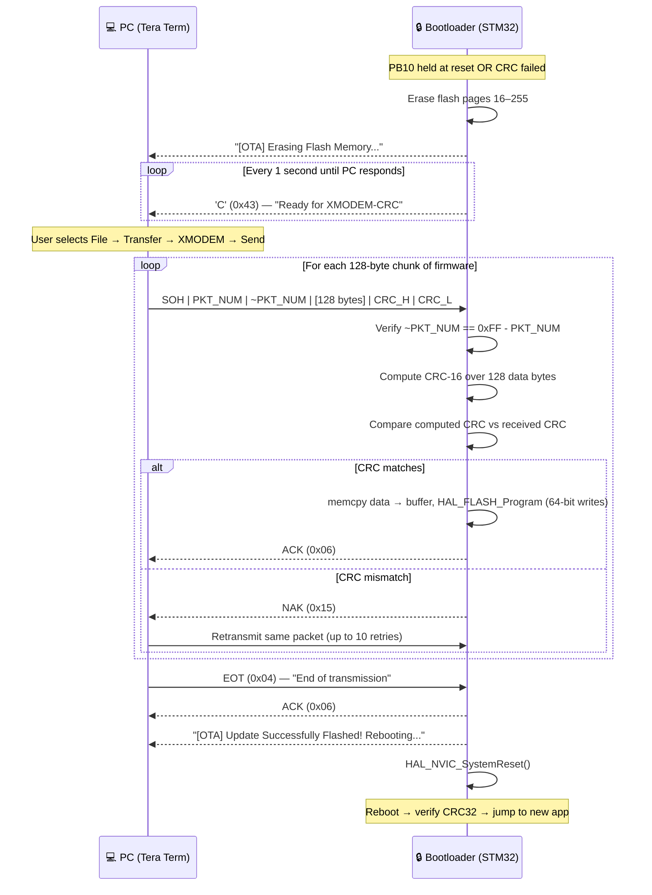

# 07 — OTA Firmware Updates via XMODEM

> **Document Version**: 1.0 | **Protocol**: XMODEM-CRC | **Terminal**: Tera Term v5.6.1 | **Baud Rate**: 115200 8N1

---

## Table of Contents

1. [What is OTA?](#1-what-is-ota)
2. [Why XMODEM?](#2-why-xmodem)
3. [XMODEM Packet Structure](#3-xmodem-packet-structure)
4. [CRC-16/CCITT — The XMODEM Checksum](#4-crc-16ccitt--the-xmodem-checksum)
5. [OTA Transfer Flow](#5-ota-transfer-flow)
6. [Flash Programming on STM32L476](#6-flash-programming-on-stm32l476)
7. [🐛 The Bug That Almost Broke OTA: Unaligned Memory Access](#-the-bug-that-almost-broke-ota-unaligned-memory-access)
8. [Step-by-Step OTA Guide (Tera Term)](#8-step-by-step-ota-guide-tera-term)
9. [What Happens If Power Fails Mid-Update?](#9-what-happens-if-power-fails-mid-update)

---

## 1. What is OTA?

**OTA (Over-The-Air)** firmware update is the ability to reprogram a microcontroller's flash memory through a communication interface — UART, USB, CAN, Bluetooth, Wi-Fi — **without physical access to a debug port**.

For a development board on your desk with an ST-Link always connected, OTA may seem unnecessary. But consider the real-world scenarios where it is not optional:

| Scenario | Without OTA | With OTA |
|---|---|---|
| Bug found in deployed product | Recall every unit, reflash with ST-Link one by one | Push update over UART/BLE/Wi-Fi to all units simultaneously |
| New feature for field devices | Physical technician visit required | Remote update with zero downtime |
| Security patch needed urgently | Days or weeks of logistics | Hours |
| Device in an inaccessible location (sensor node on a tower, device sealed in enclosure) | Physically impossible without disassembly | Trivial — send bytes over the existing communication channel |

Even on a prototype, OTA changes your development workflow: instead of reaching for the ST-Link cable after every build, you hold one button and drag-drop a file in Tera Term. **It is simply faster and more professional.**

In this project, OTA is handled entirely by the **SecureBootloader_L476** — the application firmware never needs to know about the update mechanism. This is the correct separation of concerns: the bootloader handles updates, the application handles application logic.

---

## 2. Why XMODEM?

XMODEM is a file transfer protocol designed in **1977** by Ward Christensen for bulletin board systems. In an era of 300 baud modems, every bit counted. The protocol is deliberately minimal:

- **No server software required on the PC** — Tera Term, minicom, picocom, and virtually every terminal emulator in existence include XMODEM support out of the box
- **No custom PC-side software to write** — no Python scripts, no proprietary tools, no USB drivers
- **Reliable** — each 128-byte packet is independently checksummed; failures cause retransmission, not corruption
- **Universally understood** — documented in RFCs, understood by embedded engineers worldwide
- **Works over any byte-stream transport** — UART today, could be adapted to USB CDC or RS-485 tomorrow

**Alternatives considered:**

| Protocol | Pros | Why Not Used |
|---|---|---|
| YMODEM | Sends filename + size, batch transfers | More complex receiver state machine; overkill for single-file updates |
| ZMODEM | Streaming (faster), auto-start | Requires more memory for window buffering; complex crash recovery |
| Custom binary | Maximum control | Requires custom PC-side software — no universality |
| DFU (USB) | Fast, standardized | Requires USB peripheral + host driver; no USB hardware in this design |
| SCP/TFTP | Network-native | Requires IP stack — not present on a bare-metal STM32 |

XMODEM's 47-year track record and zero-software-requirement on the host side make it the pragmatic choice for a UART-based embedded bootloader.

---

## 3. XMODEM Packet Structure

XMODEM transmits data in fixed-size frames called packets. Each packet is exactly **133 bytes** in the XMODEM-CRC variant (the variant we use — classic XMODEM uses a 1-byte checksum instead of 2-byte CRC):

```
┌────────────────────────────────────────────────────────────────────────────────────────┐
│                         XMODEM-CRC Packet (133 bytes total)                           │
├──────────┬───────────┬───────────┬──────────────────────────────┬──────────┬──────────┤
│  Byte 0  │  Byte 1   │  Byte 2   │      Bytes 3 – 130           │  Byte 131│  Byte 132│
│          │           │           │                              │          │          │
│  SOH     │  PKT_NUM  │ ~PKT_NUM  │      128 bytes of DATA       │ CRC_HIGH │  CRC_LOW │
│  0x01    │ (1, 2, …) │ (0xFF-N)  │      (payload)               │          │          │
│  1 byte  │  1 byte   │  1 byte   │      128 bytes               │  1 byte  │  1 byte  │
└──────────┴───────────┴───────────┴──────────────────────────────┴──────────┴──────────┘
     ↑           ↑           ↑                                          ↑
  Start of    Packet     One's complement                           16-bit CRC over
  Header    number       of packet number                           128 data bytes only
  byte      (wraps       (integrity check                          (not the header bytes)
            at 255→0)    for packet num)
```

**Field descriptions:**

| Field | Size | Value | Purpose |
|---|---|---|---|
| `SOH` | 1 byte | `0x01` | Start Of Header — marks beginning of a packet (vs `EOT`=end, `CAN`=cancel) |
| `PKT_NUM` | 1 byte | 1, 2, 3, … 255, 0, 1, … | Packet sequence number, wraps around at 255 |
| `~PKT_NUM` | 1 byte | `0xFF - PKT_NUM` | One's complement of packet number — receiver can detect header corruption |
| `DATA` | 128 bytes | Firmware bytes | 128 bytes of the firmware binary. Last packet zero-padded if needed. |
| `CRC_HIGH` | 1 byte | CRC[15:8] | Most significant byte of 16-bit CRC |
| `CRC_LOW` | 1 byte | CRC[7:0] | Least significant byte of 16-bit CRC |

**Control bytes (not packets):**

```
Receiver → Sender:  'C' (0x43)  — "I want XMODEM-CRC, send me data"
Receiver → Sender:  ACK (0x06)  — "Packet received OK, send next"
Receiver → Sender:  NAK (0x15)  — "Packet bad, resend it"
Sender   → Receiver: EOT (0x04) — "All data sent, transfer complete"
Either side:        CAN (0x18)  — "Cancel the transfer" (sent twice)
```

---

## 4. CRC-16/CCITT — The XMODEM Checksum

XMODEM-CRC uses **CRC-16/CCITT** with polynomial `0x1021`. This is different from the CRC-32 used by the bootloader's image verification (which uses polynomial `0x04C11DB7`).

| | XMODEM CRC-16 | Bootloader CRC-32 |
|---|---|---|
| **Purpose** | Per-packet transfer integrity | Full image integrity after transfer |
| **Polynomial** | `0x1021` (16-bit) | `0x04C11DB7` (32-bit) |
| **Initial value** | `0x0000` | `0xFFFFFFFF` |
| **Output bits** | 16 | 32 |
| **Hardware peripheral** | No (software loop) | Yes (STM32 CRC unit) |
| **Standard name** | CRC-16/CCITT | CRC-32/ISO-HDLC |

The XMODEM CRC is computed in software (no hardware peripheral needed — it runs only during the OTA transfer, not in time-critical code):

```c
/**
 * @brief  Calculate CRC-16/CCITT (XMODEM variant) over a data buffer.
 *
 * @param  data    Pointer to data bytes (128-byte XMODEM payload)
 * @param  length  Number of bytes to process (always 128 for XMODEM)
 * @return 16-bit CRC value
 *
 * @note   Polynomial: 0x1021. Initial value: 0x0000. No input/output reflection.
 *         This matches what Tera Term computes before sending each packet.
 */
uint16_t xmodem_crc(const uint8_t *data, uint16_t length)
{
    uint16_t crc = 0x0000;    // XMODEM CRC-16 initializes to 0 (NOT 0xFFFF)

    for (uint16_t i = 0; i < length; i++) {
        crc ^= ((uint16_t)data[i]) << 8;   // XOR byte into high byte of CRC

        for (uint8_t bit = 0; bit < 8; bit++) {
            if (crc & 0x8000) {             // If MSB set
                crc = (crc << 1) ^ 0x1021; // Shift left and XOR with polynomial
            } else {
                crc <<= 1;                  // Just shift left
            }
        }
    }
    return crc;
}
```

The bootloader calls this function on each received packet's 128 data bytes and compares the result to `(CRC_HIGH << 8) | CRC_LOW`. If they match: ACK. If not: NAK.

> [!NOTE]
> The two CRC algorithms (CRC-16 for XMODEM transfer, CRC-32 for image verification) serve different purposes at different levels. XMODEM CRC-16 protects each individual 128-byte packet during the serial transfer. CRC-32 is computed by `inject_crc.py` at build time and protects the entire firmware image as a whole. Both must pass for a firmware update to succeed.

---

## 5. OTA Transfer Flow



**State machine inside the bootloader:**

```c
// Simplified XMODEM receiver state machine
// Full implementation: SecureBootloader_L476/Core/Src/xmodem.c

typedef enum {
    XMODEM_WAIT_SOH,    // Sending 'C', waiting for first SOH
    XMODEM_RECV_PKT,    // Receiving 133-byte packet
    XMODEM_VERIFY,      // CRC check and flash write
    XMODEM_DONE         // EOT received, success
} XmodemState_t;

void xmodem_receive(void)
{
    uint8_t packet[133];        // One full XMODEM-CRC packet
    uint8_t expected_pkt = 1;   // Next expected packet number
    uint32_t flash_addr = APP_FLASH_BASE;  // 0x08008000, advances by 128 each packet

    // Signal readiness: send 'C' every second until first SOH arrives
    while (!uart_byte_available()) {
        uart_send_byte('C');
        HAL_Delay(1000);
    }

    while (1) {
        uint8_t first_byte = uart_recv_byte_timeout(3000);

        if (first_byte == EOT) {
            uart_send_byte(ACK);
            print("[OTA] Update Successfully Flashed! Rebooting...\r\n");
            HAL_Delay(500);
            HAL_NVIC_SystemReset();
        }

        if (first_byte != SOH) continue;   // Ignore non-SOH bytes

        // Receive remaining 132 bytes of the packet
        uart_recv_buffer(&packet[1], 132, 5000);
        packet[0] = SOH;

        // Validate packet number integrity
        if (packet[1] != expected_pkt || packet[2] != (0xFF - expected_pkt)) {
            uart_send_byte(NAK);
            continue;
        }

        // Validate CRC-16
        uint16_t calc_crc = xmodem_crc(&packet[3], 128);
        uint16_t recv_crc = ((uint16_t)packet[131] << 8) | packet[132];

        if (calc_crc != recv_crc) {
            uart_send_byte(NAK);
            continue;
        }

        // CRC OK — write 128 bytes to flash (see §6 for the bug that happened here)
        flash_write_128_bytes(flash_addr, &packet[3]);
        flash_addr += 128;
        expected_pkt++;   // Wraps 255 → 0 automatically (uint8_t overflow)

        uart_send_byte(ACK);
    }
}
```

---

## 6. Flash Programming on STM32L476

The STM32L476's flash memory has specific hardware requirements that the bootloader must respect:

### Page Size and Erase Granularity

```
STM32L476 Flash organization:
  Total: 1 MB (1,024 KB)
  Bank 1: 512 KB (pages 0–255)
  Bank 2: 512 KB (pages 256–511)
  Page size: 2 KB = 2,048 bytes

Our app lives at pages 16–255 (pages 0–15 = bootloader):
  Erase range: pages 16–255 = 240 pages × 2 KB = 480 KB for app
```

Before writing, the bootloader erases all app pages. Erasing is done page-by-page using `HAL_FLASHEx_Erase()`. An erased page reads as `0xFFFFFFFFFFFFFFFF` (all ones). You cannot write a `0` bit back to `1` without erasing — you can only write `1` bits down to `0`.

```c
// Erase all application flash pages before programming
FLASH_EraseInitTypeDef erase_init = {
    .TypeErase   = FLASH_TYPEERASE_PAGES,
    .Banks       = FLASH_BANK_1,
    .Page        = 16,          // First app page (immediately after bootloader)
    .NbPages     = 240          // Pages 16–255 inclusive
};

uint32_t page_error = 0;
HAL_FLASH_Unlock();
HAL_FLASHEx_Erase(&erase_init, &page_error);  // Takes ~2 seconds for 240 pages
// page_error: if not 0xFFFFFFFF, indicates which page failed
```

### 64-bit Double-Word Write Requirement

The STM32L476 flash controller **only supports 64-bit (8-byte) double-word writes**. You cannot write 1 byte, 2 bytes, or 4 bytes — it must always be exactly 8 bytes at an 8-byte-aligned address.

```c
/**
 * @brief  Write 128 bytes (16 × 8-byte double-words) to flash.
 * @param  flash_addr  Destination address — must be 8-byte aligned.
 * @param  data        Source data — 128 bytes from XMODEM packet.
 */
static void flash_write_128_bytes(uint32_t flash_addr, const uint8_t *data)
{
    for (int i = 0; i < 128; i += 8) {
        uint64_t double_word;

        // ⚠️ CRITICAL: use memcpy, NOT a pointer cast (see §7 for the bug)
        memcpy(&double_word, &data[i], 8);

        // HAL_FLASH_Program for double-word: writes 8 bytes at flash_addr
        // flash_addr must be 8-byte aligned — guaranteed because:
        //   - APP_FLASH_BASE (0x08008000) is 8-byte aligned
        //   - We advance by 128 bytes each packet (128 % 8 == 0)
        //   - i increments by 8 — always aligned
        HAL_FLASH_Program(FLASH_TYPEPROGRAM_DOUBLEWORD,
                          flash_addr + i,
                          double_word);
    }
}
```

> [!IMPORTANT]
> Flash must be **unlocked** before writing (`HAL_FLASH_Unlock()`) and **re-locked** after (`HAL_FLASH_Lock()`). Writing to locked flash silently fails — no error, no fault, bytes just don't change. Always check `HAL_FLASH_GetError()` after writing in production code.

---

## 🐛 The Bug That Almost Broke OTA: Unaligned Memory Access

This is the most instructive bug in the entire project. It cost hours of debugging time and the fix was one word. Understanding it deeply is the mark of an embedded engineer who truly understands the hardware.

### Symptom

After implementing the XMODEM receiver, the first test showed Tera Term's progress bar frozen at **0.6%** — exactly 1 packet (128 bytes) transferred, then nothing. The bootloader sent `ACK` for packet #1 but then went silent.

```
[OTA] Erasing Flash Memory... done.
[OTA] Waiting for XMODEM...
CCCCCC                              ← bootloader sending 'C' repeatedly
[receiving packet #1...]
                                    ← ACK sent, but then... nothing
                                    ← Tera Term shows: Packet# = 1 (frozen)
                                    ← Progress: 0.6% (frozen)
```

Tera Term showed it sent packet #2 and was waiting for ACK — but the ACK never came. The bootloader appeared to have entered a catatonic state.

### Investigation

First hypothesis: UART receive timeout. Added debug `printf` before and after each `HAL_FLASH_Program()` call:

```c
printf("[DBG] Writing double_word at 0x%08lX\r\n", flash_addr + i);
HAL_FLASH_Program(FLASH_TYPEPROGRAM_DOUBLEWORD, flash_addr + i, double_word);
printf("[DBG] Write complete\r\n");
```

The result was revealing: `"[DBG] Writing double_word..."` appeared, but `"[DBG] Write complete"` never appeared. `HAL_FLASH_Program()` never returned.

This pointed immediately to a **HardFault** — the CPU had encountered a fatal exception and was spinning in the default HardFault handler's infinite loop, unable to return.

The question became: what in `HAL_FLASH_Program()` caused a HardFault? The flash address was valid and aligned. The double-word value looked correct in the debugger.

Then the data extraction code was examined:

```c
// The original, buggy code:
uint64_t double_word = *(uint64_t*)(&packet[3 + i]);
//                     ^^^^^^^^^^^^^^^^^^^^^^^^^^^^^^^^^
//                     THIS IS THE BUG
```

### Root Cause

The XMODEM packet structure has a **3-byte header** (SOH, PKT_NUM, ~PKT_NUM). The data payload starts at `packet[3]`. When `i = 0`, the address is `&packet[3]` — offset 3 from the start of the `packet[]` array.

The `packet[]` array is allocated on the stack. Stack arrays in C are typically 4-byte aligned (because the stack pointer starts 4-byte aligned and arrays are placed consecutively). This means `packet[0]` is at, say, address `0x20001000` — divisible by 4. But `packet[3]` is at `0x20001003` — **not divisible by 8**.

When `*(uint64_t*)(&packet[3])` is evaluated, the CPU must read 8 bytes from address `0x20001003`. The ARM Cortex-M4 core requires **8-byte alignment** for 64-bit (`uint64_t`) memory accesses. An access to a non-8-byte-aligned address for a 64-bit type triggers a **BusFault** (a subtype of HardFault), and the default HardFault handler is an infinite loop:

```c
// Default HardFault_Handler in startup_stm32l476rgtx.s:
HardFault_Handler:
    b HardFault_Handler    // Infinite loop — CPU locked
```

The CPU was stuck here. It never returned from the "read double_word" operation — `HAL_FLASH_Program()` was never even called. The debug print before `HAL_FLASH_Program` appearing, while the one after didn't, was misleading — the fault actually occurred *before* `HAL_FLASH_Program` in the data-extraction line.

**Why only packet #1?**

Packet #1's data starts at `packet[3+0]` = `packet[3]`. The fault happens immediately on the first double-word read. The ACK for packet #1 was sent by a different code path that didn't reach the fault yet. The bootloader then entered the fault handler before it could process packet #2.

### Fix

One line. Replace the unsafe pointer cast with `memcpy`:

```diff
- uint64_t double_word = *(uint64_t*)(&packet[3 + i]);
+ uint64_t double_word;
+ memcpy(&double_word, &packet[3 + i], 8);
```

`memcpy` is implemented to handle **arbitrary source alignment** — it reads byte by byte internally (or uses LDR/LDRB instructions that don't fault on unaligned addresses) and assembles the 64-bit value correctly. The destination (`&double_word`) is a local variable on the stack with natural 8-byte alignment. No fault.

### Why This Matters for Interviews

> **This is exactly the kind of subtle, architecture-specific bug that separates embedded engineers who understand the hardware from those who just write code.**

On **x86/x64**, unaligned 64-bit reads are silently handled by the CPU at a small performance penalty. Code like `*(uint64_t*)unaligned_ptr` has worked on x86 for decades without issues. Many embedded engineers coming from a PC background write this instinctively.

On **ARM Cortex-M4**, the behavior depends on the **UNALIGN_TRP bit** in the CCR (Configuration and Control Register):

- `UNALIGN_TRP = 0` (default): 8/16/32-bit unaligned accesses are handled in hardware at a small penalty. **64-bit unaligned accesses always fault**, regardless of this bit.
- `UNALIGN_TRP = 1`: All unaligned accesses fault immediately.

The lesson: **never dereference a typed pointer whose alignment you cannot guarantee**. The C standard calls this undefined behavior. x86 happens to tolerate it; ARM Cortex-M4 does not tolerate it for 64-bit types.

The rule for embedded code:

```c
// ❌ UNSAFE — assumes source is aligned to sizeof(T)
T value = *(T*)arbitrary_pointer;

// ✅ SAFE — memcpy handles any source alignment
T value;
memcpy(&value, arbitrary_pointer, sizeof(T));
```

This applies to any type larger than the minimum guaranteed alignment of your source: `uint32_t`, `uint64_t`, struct types. When in doubt, `memcpy`.

---

## 8. Step-by-Step OTA Guide (Tera Term)

Follow these steps exactly to perform a firmware update. Total time: approximately 30 seconds for a 100 KB image.

### Prerequisites

- Tera Term v5.6.1 installed
- STM32 Nucleo-L476RG connected via USB (ST-Link USB port, not a separate UART adapter — the ST-Link provides a virtual COM port)
- New firmware `.bin` file ready (output of PlatformIO build + `inject_crc.py` post-build script)
- The `.bin` file already has CRC injected (check build output for `[CRC Injector] CRC32=0x...`)

### Step-by-Step

**Step 1 — Enter bootloader OTA mode:**

```
① Hold down the external breadboard button (PB10) — keep it pressed
② Press and release the Nucleo RESET button (black button on board)
③ Keep PB10 held for ~1 more second
④ Release PB10
```

The bootloader reads PB10 on startup. Holding it during reset signals "force OTA mode."

**Step 2 — Open Tera Term and connect:**

```
① Open Tera Term
② File → New Connection
③ Select: Serial
④ Port: your STM32 COM port (check Device Manager → Ports → STMicroelectronics STLink Virtual COM Port)
⑤ Click OK
```

**Step 3 — Configure the serial port:**

```
Setup → Serial Port:
  Speed:    115200
  Data:     8 bit
  Parity:   None
  Stop:     1 bit
  Flow:     None
Click OK
```

**Step 4 — Confirm bootloader is waiting:**

You should see in the Tera Term terminal window:

```
[BOOT] SecureBootloader v1.0 starting...
[BOOT] Force update mode detected (PB10 held).
[OTA] Erasing Flash Memory... done.
[OTA] Waiting for XMODEM (CCCC = ready)...
CCCCCCCCCC...
```

The `CCCCC...` output means the bootloader is actively sending the XMODEM-CRC initiation character every second, waiting for your terminal to respond.


> [!TIP]
> If you don't see this output, check that you selected the correct COM port and baud rate. Also ensure PB10 was held during the reset — not just before or after.

**Step 5 — Start the XMODEM transfer:**

```
File → Transfer → XMODEM → Send...
```

In the file picker that opens, navigate to your firmware `.bin` file. It will be in:
```
FreeRTOS_App_L476\.pio\build\nucleo_l476rg\firmware.bin
```

Click **Open**. Tera Term's XMODEM send dialog appears and the transfer begins immediately.

**Step 6 — Watch the progress:**

Tera Term shows a progress dialog:

```
XMODEM Send
File: firmware.bin
Packet#: 47
File Size: 85632 bytes
Transferred: 6016 / 85632 bytes (7%)
[████████░░░░░░░░░░░░░░░░░░░░░░░░]
```

Packet numbers increment every ~133 bytes. Transfer speed at 115200 baud is approximately 10 KB/s, so a 100 KB image takes about 10–15 seconds.

**Step 7 — Confirm success and wait for reboot:**

When the last packet is sent and ACKed, Tera Term closes its dialog. The Tera Term window shows:

```
[OTA] Update Successfully Flashed! Rebooting...

[BOOT] SecureBootloader v1.0 starting...
[BOOT] Checking application image...
[BOOT] Magic OK: 0xAA55AA55
[BOOT] Calculating CRC32... done.
[BOOT] CRC match. Jumping to application.

[APP] FreeRTOS Application v1.2 starting...
[APP] All tasks initialized. System running.
```

The board has rebooted, the bootloader verified the new image's CRC, and control was handed to the new application. The update is complete.

> [!IMPORTANT]
> If the `[CRC Injector]` line was absent from your PlatformIO build output, the `.bin` file has `0xFFFFFFFF` in the CRC field and will fail verification. The bootloader will print `[BOOT] CRC MISMATCH!` and re-enter OTA mode. Re-check that `inject_crc.py` ran successfully as a post-build step.

---

## 9. What Happens If Power Fails Mid-Update?

This is an important question that every bootloader designer must answer honestly. The answer for this bootloader:

**It depends on when the power fails:**

| Phase | What's on Flash | Next Boot Behavior |
|---|---|---|
| **Before erase starts** | Old (valid) app still in flash | Normal boot, old app runs. Update never started. |
| **During erase** | Pages partially erased — some pages `0xFF`, some still have old code | CRC fails (image is garbage). Bootloader enters OTA mode. Ready for new update. |
| **During write** | Partial new app — some pages written, some erased but empty | CRC fails (incomplete image). Bootloader enters OTA mode. Ready for new update. |
| **After write, before reboot** | Complete new app in flash (CRC injected by build) | Normal boot on next power-on. Bootloader verifies CRC, jumps to new app. ✓ |

**The critical safety property:**

Because the bootloader erases the application flash *before* writing the new image, a power failure during the process always leaves the flash in a state that fails the CRC check. And a CRC failure means the bootloader falls back to OTA mode — not a random jump to corrupted code, not a hang, not a brick.

**The device is never permanently bricked.** As long as the bootloader itself (pages 0–15) survives (it is never erased during an OTA update), the device can always accept a new firmware image.

```
Power failure during update
    → Next boot: bootloader starts
    → Reads AppHeader: magic might be 0xFF (erased) or corrupted
    → CRC fails (or magic fails before CRC is even checked)
    → Falls into OTA mode
    → Sends 'C' every second, waiting for rescue firmware
    → Connect Tera Term, send valid firmware
    → Device recovered ✓
```

> [!NOTE]
> This is sometimes called **"safe-fail"** or **"fail-open"** design. The system fails into a recovery state, not a dead state. For a truly mission-critical product (medical, automotive), you would add a second bank of flash (ping-pong update) so the old firmware remains valid until the new one is fully verified. The STM32L476's 1 MB flash, divided into two 512 KB banks, actually supports hardware dual-bank OTA — a natural next evolution of this bootloader.

---

*← [06 — Sensors & EXTI](06_sensors_exti.md) | [08 — CLI & UART Terminal](08_cli_uart.md) →*
